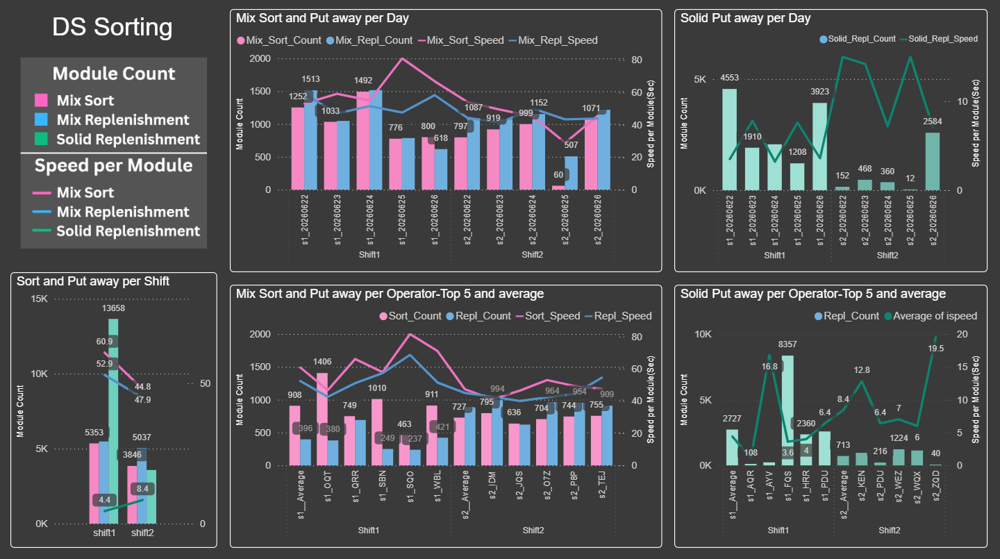

# DS Sorting KPI



<sub>Power BI dashboard — weekly sorting & putaway KPI</sub>

> _Report preview. Operational volume metrics are shown as generated; the employer, customer/supplier names, order/part identifiers, and employee names have been redacted or replaced with placeholders for this public portfolio._


## Running the script

```bash
python "DS Sorting KPI v2.0.py"
```

Run on a Monday. The script auto-calculates the previous week's date range (Mon–Sat) from `today`. No arguments needed.

## What the script does

Single-file Python script that reads warehouse operation CSVs, computes weekly KPI metrics, and writes one HTML report (chart embedded as base64 PNG) plus 8 intermediate CSVs for Power BI.

### Input files (`Data\`)

| File | Key columns used |
|---|---|
| `SORTING_MODULE.csv` | cols 0,1,2,5,6,7 → `Stat_Time, End_Time, OPCD, Step, Unit, Module` |
| `PUTAWAY_UNIT.csv` | cols 0,1,2,3,6,10 → `Stat_Time, End_Time, Spend, OPCD, Container, Module` |
| `102.csv` | cols 1,3,8,21 → `Container, Unit, Module, Mix_Solid` — lookup table |

`102.csv` column 21 (`Mix_Solid`) classifies modules as `SO` (solid) or `MO` (mixed). This drives all downstream `Mix_Solid` logic.

### Processing pipeline

Both data flows (Sort and Deli/Putaway) share the same three-stage pipeline:

1. **`set_com1`** — parse the `YYYYMMDDHHmm` timestamp, derive `sOperationDate`, `sShift`, and `OPCD2`.
   - Times before 05:00 are attributed to the *previous* calendar day.
   - Shift1 = 05:00–16:30; Shift2 = everything else.
2. **`set_sum1`** — group consecutive records into sort sessions using a 20-minute gap threshold (`SORT_INTERVAL`). Records more than 20 min apart start a new group (`iG`).
3. **`set_sum2`** — aggregate each group into (start time, end time, count), then call `calc_time` to get `tspend` and `ispeed` (seconds per module).

`Mix_Solid` values are renamed in output DataFrames:
- `MO` → `Mx_Repl` (for putaway) or `Mx_Sort` (for sorting)
- `SO` → `So_Repl`

### Output

- **HTML report** → `Html\DS_Sorting_KPI_<YYYYMMDD>.html` (date = previous Monday)
- **BI CSVs** → written to both `work3\` and the shared BI network path (`BI_PATH`)

BI CSV files: `df_deli_shift1`, `df_sort_shift1`, `df_deli_day1`, `df_sort_day1`, `df_per_day`, `df_day_pv`, `df_shift1/2_ope_Mix_average`, `df_shift1/2_ope_Solid_average`.

### Chart layout

The matplotlib figure uses a 3-row × 18-column subplot grid (`figsize=(18,11)`):

| Subplot positions | Chart |
|---|---|
| 1–5 | Sorting & Putaway per Shift (3 bars + speed lines) |
| 19–25 | Mix Sort & Putaway per day (4 bars + lines, shift1 vs shift2) |
| 30–34 | Solid Putaway per day |
| 37–43 | Mix Sort & Putaway per Operator (top 5 + average) |
| 48–52 | Solid Putaway per Operator (top 5 + average) |

## Key configuration variables

```python
iSortKPI_Available = 1   # Set to 0 when SORTING_MODULE.csv has no data for the week
SORT_INTERVAL = 20       # Minutes gap that splits a new sort session group
BASE_PATH = "./DS Sorting\\"
BI_PATH   = "./bi_data/DS_Sorting_Weekly\\BI Data\\"   # OneDrive-synced SharePoint folder
```

`BI_PATH` is the OneDrive-synced SharePoint location that feeds the Power BI report. Both paths are machine-specific — update them when moving to a different user profile.

## Dependencies

`pandas`, `numpy`, `matplotlib` — standard data science stack, no `requirements.txt` present.