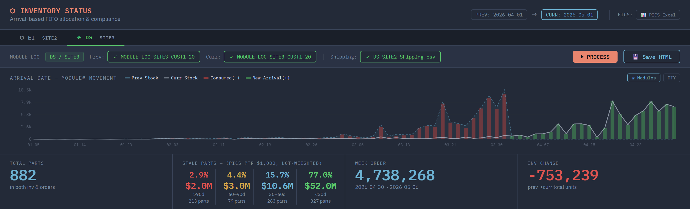

# Multi-Warehouse FIFO Inventory Rundown



<sub>Multi-warehouse FIFO inventory status dashboard</sub>

> _Report preview. Operational volume metrics are shown as generated; the employer, customer/supplier names, order/part identifiers, and employee names have been redacted or replaced with placeholders for this public portfolio._


# FIFO Inventory Rundown — Project Context

A weekly multi-warehouse HTML report for arrival-based FIFO rundown of the OEM client parts inventory at Example Logistics. Three tabs: **IP** (Site 2, SITE2), **DS** (SITE3), **SITE1** (Site 1, SITE1). Run manually by the user once per week from a single Python script; output is one self-contained `.html` file the user emails or shares.

## Audience

- **Japanese counterparts**: Sachiko-san, Noguchi-san — supply chain oversight
- **US team leads**: Nicki-san, Angela-san — warehouse operations

## Business purpose

Visibility into how old on-hand inventory is and what's moving, so ADI can decide whether to consume existing stock before receiving more shipments. JP supply chain culture is heavy on FIFO discipline as a measurable.

## Communication preference

Simple, direct, best-answer responses. No "here are 3 options" — pick the best one and say it. No clarifying questions unless absolutely necessary. Treat me as a peer: skip basics, give pasteable code, explain the *why* on non-obvious decisions only.

## How to run

```
python generate_report.py            # writes ./FIFO Inventory Rundown YYYYMMDD.html
python generate_report.py --open     # also opens it in the default browser
```

CLI flags are intentionally minimal: `--output PATH`, `--open`. Inputs are not flag-driven — the script always reads from the per-warehouse folders below.

Dependencies: `pandas>=2.0`, `plotly>=5.0`, `openpyxl>=3.1` (see `requirements.txt`).

---

## Architecture

Single Python script → single HTML file. No SharePoint connectors, no scheduled refresh, no DAX. Inputs are placed manually by the user (inventory + shipping CSVs from email), then the script is run and the HTML is shared.

```
generate_report.py     ← run this
  reads, per warehouse:
    {IP,DS,IN} data/current 502.csv             (latest inventory snapshot)
    {IP,DS,IN} data/MODULE_LOC_*.csv            (~7d-old archived snapshot for PREV)
    {IP,DS,IN} data/202.csv                     (latest shipping plan)
    {IP,DS,IN} data/201P.csv                    (forward-looking order backlog — optional)
  reads, shared across warehouses:
    Inventory Value Revision/Parts Inventory Info and Price.xlsx   (USD unit prices)
  writes:
    ./FIFO Inventory Rundown YYYYMMDD.html
```

`502`, `202`, and `201P` are the WMS report numbers (502 = inventory, 202 = shipping plan, 201P = forward-looking order backlog). Snapshot files retain their WMS dump filenames (`MODULE_LOC_<LOC>_<COMPANY>_YYYYMMDD_HHMMSS.csv`) so they can be dropped from email attachments without renaming. `201P.csv` is optional — if missing, the week-order tile falls back to 202 only.

The output HTML is fully self-contained — Plotly is inlined **once** (not per chart), all CSS inline, vanilla JS for tabs/filters/FIFO drilldown. Opens in any browser, works offline.

### Multi-warehouse rendering

Three warehouses are processed in a loop in `build_warehouse_section()`. The page is one outer `PAGE_TEMPLATE` (tab nav + shared `<style>` + shared `<script>`) wrapping three `WAREHOUSE_SECTION_TEMPLATE` fragments. Each fragment is a complete chart + KPI strip + filter/table block, scoped via a `data-wh="<code>"` container; lot-row IDs are prefixed `lot-<code>-<rowid>` so the three tables never collide. JS uses `querySelectorAll('.warehouse-section')` and wires each section independently. Tab switching toggles `.active` and calls `Plotly.Plots.resize()` on the now-visible chart (Plotly under-sizes when its container is `display:none` at draw time).

`include_plotlyjs="inline"` is set only on the first warehouse's chart; the other two pass `False`. Don't change this — including the Plotly bundle three times triples the output size.

### Tech stack
- `pandas` — CSV parsing and aggregation
- `plotly` — interactive combo chart
- `openpyxl` — read the price master Excel
- Python stdlib `string.Template` for the page template (**note**: `Template.substitute` requires escaping any literal `$` as `$$` — including in CSS, JS strings like `'$' + amount`, comments inside the template body, and i18n labels like `'Value ($)'`. Easy to miss; running the report end-to-end after edits is the fastest validator.)

### Helper formatters
Three small utilities live near `compute_kpis` and are used both in Python rendering and mirrored in JS (`fmtDollars` / `fmtDollarsK` in the chart toggle). Keep the JS copies in sync with the Python — they format the same data when the user flips chart modes.

- **`fmt_dollars(x)`** — compact USD: `$52M` / `$10.6M` / `$520K` / `$45`. Rolls to M at the **K-rounding boundary** (`a >= 999_500`), not at `1_000_000`, so a value never reads as `$1,000K` on one tile while another shows `$1.0M`.
- **`fmt_dollars_k(x)`** — same shape with comma-separated K precision: `$1.3M` / `$999K` / `$143K` / `$45`. Used for the WoW row + Since-Last-Week tile so the four bucket deltas can be eyeballed against the tile total at K precision below 1M, and rolls over to M (1dp) at the same `999_500` threshold.
- **`fmt_pct(x)`** — `2.9%` (1dp under 10) / `77.0%` / `0%`.
- **`fmt_wow_delta(x)`** — returns a single string for the in-tile WoW line: `+$171K since last week` / `−$280K since last week` / `no change since last week` / `no prior week`. Uses U+2212 `−` (minus, not hyphen). **Single channel, neutral colour by design.** Two earlier iterations (a) coloured the dollar by health-in-context and inverted the meaning for the fresh bucket, and (b) split into a directional dollar plus a `✓`/`!` health badge — both produced more confusion than they removed (same `−$X` reading green in one column and red in another, or two competing colour channels per tile). The user explicitly wanted the badge gone; sign carries direction and the reader interprets context themselves.

The Since-Last-Week tile uses an inline `+` / `−` glyph rendered through the `.arrow` class, which sets `font-size: inherit` so the sign matches the 40px numeric (it used to render at 16px next to a 40px number, which read as a typo).

### Data sources

**Inventory CSV** (`{IP,DS,IN} data/current 502.csv`)
- Source: email attachment, dropped manually each week
- **Comma-separated**, quoted fields, CRLF
- Snapshot date precedence: filename (`MODULE_LOC_<LOC>_<COMPANY>_YYYYMMDD_HHMMSS.csv`; `YYYY-MM-DD[_HHMMSS].csv` accepted as a manual fallback) → file mtime
- Columns: LOCATION, MODULE#, PRODUCT, COMM PRODUCT, PILOT, QUANTITY, ETA, DAMAGE, CONTAINER, UNITLOAD#, ARRIVAL DATE, ORDER NO, ORDER LINE NO
- Schema is identical across all three warehouses
- Dates ISO `YYYY-MM-DD` (both ETA and ARRIVAL DATE)
- ORDER NO is **blank/whitespace-padded** for unallocated stock (not the literal string "0")
- ORDER LINE NO is always 0 (not useful)
- ETA = predicted arrival, ARRIVAL DATE = actual arrival; both always populated
- Module disappears from CSV when it ships

**Shipping CSV** (`{IP,DS,IN} data/202.csv`)
- **Comma-separated**, quoted fields. Grain is approximately one row per `(PARTS NO, MODULE NO, ORDER NO)` triple — `QTY` = pieces of that part in that module/order. Modules with no allocation yet have blank `MODULE NO`; the same order can split across pre-allocated lines (filled `MODULE NO`) and unallocated lines (blank `MODULE NO`). **Rows persist in the file after physical loading**, with `SHIPMENT_LOAD_DATETIME` getting stamped — code must filter these out for any "still pending" KPI (see THIS WEEK'S ORDER below).
- Joins to inventory on **MODULE NO = MODULE#** *and* **PARTS NO = PRODUCT** (per-part KPIs and next-order lookups).
- Dates ISO `YYYY-MM-DD`; **times period-separated `HH.MM.SS`** (combined into `*_DATETIME` columns in `load_shipping`). The WMS exports `0001-01-01 / 00.00.00` as a sentinel for "not yet picked / loaded / shipped" — `load_shipping` nullifies anything ≤ `0001-01-01` so downstream "is it already loaded?" checks treat the sentinel as NaT, not a real past timestamp.
- ORDER NO format example: `DAOQ610_20260416` (underscore-delimited with date suffix)
- **Schema differs by warehouse — `load_shipping` tolerates this:**
  - SITE1/DS: TEMP.TRAILER, TRAILER NO, **SUPPLIER CODE**, ORDER NO, M/F RECEIVER, PALLETIZASION, SKIDID, PARTS NO, QTY, MODULE NO, **SERIAL NO**, PILOT NO, PLAN SHIP DATE/TIME, PICKING DATE/TIME, LOADING SET DATE/TIME, **LOADING ENTRY DATE/TIME**, SHIPMENT LOAD DATE/TIME
  - IP: same shape **but** `DOCK CODE` instead of `SUPPLIER CODE`, **no `SERIAL NO`**, **no `LOADING ENTRY` date/time pair**
  - When adding new shipping logic, gate column references with `if col in df.columns` (or rely on the existing tolerant loops in `load_shipping`).
- No DOCK field exists in the SITE1/DS CSVs — DOCK column on the report maps to `TRAILER NO` of the next pending shipment.
- **PARTS NO format differs by warehouse**: IP exports the no-hyphen `COMM PRODUCT` form (e.g. `904400825`), while DS/SITE1 export the hyphenated `PRODUCT` form (e.g. `90440-0825`). `build_warehouse_section` rewrites IP's `PARTS NO` via the `COMM PRODUCT → PRODUCT` map derived from that warehouse's inventory CSV so all downstream `PARTS NO == PRODUCT` joins (week-order qty, next pending shipment per part) work uniformly. No-op for DS/SITE1 — their `COMM PRODUCT` already equals `PRODUCT`.

**Order backlog CSV** (`{IP,DS,IN} data/201P.csv`, IP exports `201P.CSV` — case-insensitive lookup via `find_backlog`)
- Source: email attachment, dropped manually each week alongside `202.csv`. **Optional input** — `load_orders_backlog` returns an empty frame if the file is absent, and `build_warehouse_section` logs `no 201P backlog file`.
- Holds **forward-looking orders not yet planned into 202** — fully disjoint order set from 202 (verified at 0% overlap on `CUSTOMER ORDER` across all three warehouses on the 2026-05-11 snapshot).
- Schemas differ:
  - **DS/SITE1**: `CUSTOMER ORDER NO., SUPPLIER CODE, SHIP DATE, SHIP TIME, ORDER DATE, TYPE, UC/CNL, STATUS, REWARDS ORDER NO., TEMPORARY TRAILER NO., SET LANE, SUPPLIER NAME, PRODUCT NO., QUANTITY, PILOT NO.` — `SHIP DATE` is the planned ship date.
  - **IP**: `ORDER, CUSTOMER ORDER, ORDER DATE, CONSIGNEE, CONSIGNEE NAME, PLAN SHIP, SHIP DATE, PRODUCT NO., QUANTITY, ..., STATUS, ...` — IP's `SHIP DATE` column is **always the `0001-01-01` sentinel**; the real planned ship date is in `PLAN SHIP`. Loader detects the IP shape by the presence of `PLAN SHIP` + `CUSTOMER ORDER` columns.
- **PRODUCT NO. is hyphenated on all three warehouses** (unlike 202.csv where IP uses the no-hyphen `COMM PRODUCT` form). No translation needed — joins to inventory `PRODUCT` directly.
- **STATUS values**: blank (normal pending), `Shortage` (real demand, can't fulfill from current stock), `Skip` (cancelled/won't ship this cycle). `load_orders_backlog` **drops `Skip` rows** and keeps blank + `Shortage`.
- **Normalized output columns** (after `load_orders_backlog`): `PARTS NO`, `QTY`, `PLAN_SHIP_DATE`, `STATUS`, `ORDER_NO`.
- No MODULE NO on these rows — they pre-date module allocation. So they contribute to qty-mode and $ value-mode of the week-order tile but **not** to modules-mode (which counts distinct `MODULE NO` from 202 only). This is intentional and reflects what the data can know.

**Price master** (`Inventory Value Revision/Parts Inventory Info and Price.xlsx`)
- Sheet `detail`, header at row 12; relevant columns: `Parts No.(with Color)` (col 14), `Parts No.` (col 15), `Color` (col 16), `Unit Price` (col 73, the "BU" column when viewed in Excel — value is per-unit USD).
- Single global price master across all three warehouses; one Excel for IP/DS/SITE1 combined. There is no warehouse partition. Snapshot, not historical — same prices apply to PREV and CURR (so WoW $ deltas measure quantity drift at constant price).
- **Join key**: strip all hyphens from `Parts No.(with Color)`, uppercase, → matches inventory's `COMM PRODUCT` byte-for-byte. Color-variant inventory rows (`VA43-67-UC5  N7`) match because `COMM PRODUCT` (`VA4367UC5 N7`) equals the col-14 form (`VA43-67UC5- -N7`) once hyphens are dropped. Verified empirically at 100% of inventory QTY (only 1 part of 1645 has no price-master row at all — valued at $0).
- Duplicates in the price master only occur across colors and collapse cleanly via mean (handled in `load_prices`).
- If the file is missing, `load_prices` warns to stderr and returns an empty Series — value-based KPIs render as `$0` / `—` / `n/a`, qty/modules KPIs are unaffected.

### Folder structure

```
KPI/IN, DS, IP FIFO Inventory Rundown/
  CLAUDE.md
  generate_report.py                                ← run this
  requirements.txt
  IP data/                                          ← Site 2 (SITE2 / CUST1)
    current 502.csv                                 ← latest inventory snapshot
    MODULE_LOC_SITE2_CUST1_YYYYMMDD_HHMMSS.csv         ← archived snapshots (one or more)
    202.csv                                         ← latest shipping plan
    201P.CSV                                        ← forward-looking order backlog (optional)
  DS data/                                          ← (SITE3 / CUST1)
    current 502.csv
    MODULE_LOC_SITE3_CUST1_YYYYMMDD_HHMMSS.csv
    202.csv
    201P.csv
  IN data/                                          ← Site 1 (SITE1 / CUST1)
    current 502.csv
    MODULE_LOC_SITE1_CUST1_YYYYMMDD_HHMMSS.csv
    202.csv
    201P.csv
  FIFO Inventory Rundown YYYYMMDD.html              ← generated output
```

**Manual workflow** for each weekly run:
1. In each warehouse folder, rename the previous `current 502.csv` to its WMS dump pattern (`MODULE_LOC_<LOC>_<COMPANY>_YYYYMMDD_HHMMSS.csv`) — leave it in the same folder.
2. Drop the freshly downloaded inventory CSV at `current 502.csv`.
3. Drop the freshly downloaded shipping CSV at `202.csv` (overwrite).
4. Drop the freshly downloaded order backlog at `201P.csv` (or `201P.CSV` on IP — case is preserved; overwrite). Optional but recommended — without it the week-order tile misses pre-allocation orders.
5. Repeat for all three warehouses.
6. `python generate_report.py --open`.

---

## Calculations

Each warehouse runs the full pipeline independently. KPIs and the chart are computed against that warehouse's CURR snapshot date so output is idempotent for a given input set.

### PREV baseline
`pick_prior(curr_snapshot, folder)` scans `<folder>/MODULE_LOC_*.csv`, parses the filename timestamp (or falls back to mtime), and picks the file with timestamp closest to but not exceeding `(CURR snapshot − 7 days)` measured from `CURR snapshot 00:00`. Falls back to the oldest available if nothing qualifies. If no `MODULE_LOC_*.csv` exists, PREV = CURR and the chart's Consumed/Arrivals bars show zero.

### KPIs (per warehouse)
- **TOTAL PARTS**: distinct PRODUCTs that appear in BOTH current inventory AND in shipping with `PLAN SHIP DATE >= today` (anchored to the CURR snapshot date, not wall-clock today). Subtitle: "in both inv & orders".
- **THIS WEEK'S ORDER**: sum of `Shipping[QTY]` (qty mode) / distinct non-blank `MODULE NO` count (modules mode) / sum of `QTY × Unit Price` (value mode), for rows whose `PLAN SHIP DATE` falls in the current ISO week (Mon–Sun) of the snapshot date **AND** that have not already physically loaded as of the snapshot. The "already-loaded" gate (rows whose `SHIPMENT_LOAD_DATETIME` is set and ≤ snapshot midnight) is critical — `202.csv` retains rows after loading, so without it mid-week reports show ~80–95% of the week as "still to ship" when most of it has already left. Same gate applies to per-part `week_order` column in the detail table and to the `next_order` lookup. **The 201P backlog is added on top** in qty + value modes (disjoint order set, no double-count). Modules mode is 202-only because 201P rows have no MODULE NO assigned yet — so modules-mode counts what's *planned*, qty/$ counts everything *ordered* (planned + backlog). Subtitle: short-date week range (e.g. `May 11 → May 17`).
- **SINCE LAST WEEK** (formerly "Last Week's Change"): `SUM(CURR QUANTITY) − SUM(PREV QUANTITY)` (qty mode) / `nunique(CURR MODULE#) − nunique(PREV MODULE#)` (modules mode) / `SUM(CURR VALUE) − SUM(PREV VALUE)` (value mode). Sign rendered as `+` / `−` (U+2212), not arrows. Subtitle: short-date span between PREV and CURR snapshots (e.g. `May 4 → May 11`). The big number swaps with the chart toggle; the date subtitle is static (does not swap with mode). **When no MODULE_LOC_*.csv exists** (PREV = CURR), renders "no prior week" instead of `·$0`, matching the bucket WoW lines. A `data-no-prior="1"` attribute on the tile's div tells the JS mode-toggle to leave the text alone.

`compute_kpis` also returns **`avg_age`** (qty-weighted average age across CURR, NaN-aged rows excluded from both numerator and denominator) and **`stale_qty_pct`** (qty share of CURR with `Age_Days > 30`). Currently computed but **not rendered** in the KPI strip — kept around as easy hooks for a future "FIFO health" tile (see open questions).

### Consolidated health row (single horizontal strip)
The KPI tiles and the lot-weighted stale tiles are rendered as **one unified `.metrics.health-row` panel** with four sections in a single row:

```
[ Total Parts | STALE GROUP — header + 4 sub-tiles (>90d / 60-90d / 30-60d / <30d) | This Week's Order | Since Last Week ]
```

Grid sizing is `1fr 4fr 1fr 1fr` — the stale group occupies 4× the width of each KPI tile so its 4 sub-tiles match KPI tile width. Outer KPI tiles use the `.metric.compact` variant. The stale group has a slightly darker background tint and a thin header strip spanning all 4 columns reading "AGED INVENTORY COMPOSITION · % of total $ on hand & week-over-week change in $" — without it the bottom-of-tile WoW deltas read as orphaned numbers. The header is one of the stale-group's grid children, so any responsive `nth-child` selector targeting tiles must skip it (tiles are children 2..5).

**Responsive fallbacks** (`@media` rules in PAGE_TEMPLATE):
- Below 1500px: stale group drops to a full-width row beneath the 4 KPI tiles (2-row layout).
- Below 880px: 2-column stack on mobile (KPIs and stale tiles both in pairs); see the `nth-child(2/3/5)` selectors that account for the header child.

### Stale Inventory tiles (lot-weighted)
Each of the 4 sub-tiles inside the stale group stacks vertically: band label (top) → % of total (large, colored by severity) → bucket total (small, muted) → **WoW line** on its own row at the bottom: `+$171K since last week` / `−$280K since last week` / `no change since last week` / `no prior week`. A 3px coloured severity stripe (red / orange / yellow / green) sits at the top of each tile. All three numbers swap with the chart's QTY/MODULES/VALUE toggle (see below).

**Lot-weighted, NOT per-part**: every inventory row goes in the bucket matching its OWN `Age_Days`. Bucket totals = sum/nunique of `QUANTITY` / `MODULE#` / `VALUE` over rows whose age falls in the band — so totals reconcile exactly to the warehouse total in each mode, and each band's percentage reflects what's actually in that age range. Per-part bucketing (an earlier draft) over-counted fresh inventory of partially-stale parts as "stale" and was misleading — fixed by `_bucket_stats` in [generate_report.py](generate_report.py).

**Parts count caveat**: each tile counts distinct PRODUCTs that have at least one lot in that age band. The same part can have lots in multiple bands (very common — the OEM client parts arrive in waves), so per-tile counts can sum to MORE than the warehouse's total distinct part count. This is the honest answer to "how many parts have stock in this age range?" and intentionally differs from the top-of-page Total Parts tile.

**WoW computation**: `delta = curr_bucket_X − prev_bucket_X` per bucket, where X is the active mode (qty / modules / value). In value mode PREV is valued at CURR prices (so the delta measures quantity drift at constant price, not price moves). In every mode the four bucket deltas sum exactly to the matching `Since Last Week` tile (`inv_change` / `inv_change_mod` / `inv_change_value`). **Rendering is intentionally neutral** (no green/red, no inversion logic, no health badge) — see the `fmt_wow_delta` notes above for the history of why two more elaborate designs were tried and dropped.

### Chart QTY/MODULES/VALUE toggle (one toggle, three tile groups)
The chart's mode toggle is **global, not per-warehouse** — clicking it broadcasts to all three sections' bucket strips, KPI tiles, and Plotly charts in one shot, so switching tabs preserves the active mode. Choice is persisted in `localStorage` key `fifo-rundown-mode` and survives reload. **Default is VALUE ($)** — Python's initial render (chart trace visibility, y-axis `$`/`~s` formatting, and all `textContent` on the value/SLW/bucket tiles) is the value-mode form, and JS only mutates DOM if a non-default mode is saved.

Tiles that swap: **This Week's Order**, **Since Last Week**, and the four **aged-bucket** sub-tiles (`pct` / `val` / `wow` each). All values are stashed in `data-qty` / `data-mod` / `data-val` attributes on the relevant element; JS `updateKpis(section, kpiKey)` reads the active mode's attr and writes textContent (or innerHTML for the bucket `wow` because its phrase is i18n-spanned — `_attr_esc` in Python keeps the markup intact inside the double-quoted attr). After each mode swap `setMode` re-runs `applyLang(currentLang)` to translate the freshly-injected wow nodes. The date subtitles on the SLW / Week-Order tiles do NOT swap (static text). Plotly's y-axis tick formatting (`$` prefix, `~s` SI compaction) is applied via `relayout` only in value mode and cleared otherwise.

### Main chart — "ARRIVAL DATE — MODULE# MOVEMENT"

**X axis = ARRIVAL DATE** (the date each module physically arrived). This is *not* a time-series of historical inventory totals. It's the age distribution of *today's* on-hand stock plotted by arrival date. Bars further left = older stock. Window = last ~16 weeks.

Series (4 traces, repeated 3× — once per mode, total 12 traces. The `_series_by_arrival(df, value)` helper switches the aggregation: `value="qty"` sums QUANTITY, `"modules"` counts distinct MODULE#, `"value"` sums VALUE = QUANTITY × Unit Price):
- **Prev Inv** (line, dotted): aggregation of PREV grouped by ARRIVAL DATE
- **Curr Inv** (line, solid): aggregation of CURR grouped by ARRIVAL DATE
- **Consumed** (negative red bars): MODULE#s present in PREV but missing from CURR — aggregation over those rows in PREV by ARRIVAL DATE
- **Arrivals** (positive green bars): MODULE#s present in CURR but not in PREV — aggregation over those rows in CURR by ARRIVAL DATE
- VALUE-mode bar/line traces also set `hovertemplate="$%{y:,.0f}"` so tooltips read as dollars (qty/modules modes use Plotly default tooltips).
- **Default-visible traces are 8–11 (VALUE)** — `build_chart` draws qty/modules hidden. Y-axis is initialized with `tickprefix="$"` and `tickformat="~s"`; the JS `setMode` clears these when switching to qty/modules. Toggle: QTY ↔ MODULES ↔ VALUE ($) (Plotly `restyle` swaps trace visibility — index ranges 0–3 / 4–7 / 8–11 are baked into the JS, so adding/removing traces requires updating both. The Japanese trace-name array in `TRACE_NAMES` and the `applyLang` `restyle` index list must also stay aligned — currently 12 entries each.)
- Value mode also calls `Plotly.relayout` to set y-axis `tickprefix="$"` and `tickformat="~s"` (SI compaction), and it gets cleared back to defaults when switching modes.

### Detail table (one row per PRODUCT)
Default sort is oldest-first by `MAX(Age_Days)`. Columns: PART NO, AGE (badge with `!` if ≥90d, color ramp red/orange/yellow ≥90/60/30), CURR INV, PREV INV, CHANGE, THIS WEEK'S ORDER, NEXT ORDER / DOC / DOCK, NEXT SHIP, LOTS. The header still reads "Doc" but the cell stacks only `next_order` and `Dock: <trailer>` — the doc slot is unsourced (see open questions). **Next Order lookup**: earliest `PLAN_SHIP_DATETIME` among rows that have not yet physically loaded (`SHIPMENT_LOAD_DATETIME` unset or > snapshot). Past-dated rows whose plan date has already passed but which haven't loaded are intentionally included — they represent overdue obligations and are the most urgent "next" order for that part. Sentinel/NaT `PLAN_SHIP_DATETIME` rows are excluded.

**FIFO drilldown**: each row is clickable. Click expands a per-part lot list showing every distinct ARRIVAL DATE for that PRODUCT — oldest first, with a colored severity edge per row. Each line carries: arrival date, age badge, INV QTY, MODULE# IDs (comma-separated; falls back to a count when the list is empty), allocation ratio (`X/Y alloc` or `unalloc`), and a damaged-count flag. Above the list a meta strip summarizes the part: age range (`Aged 12d–95d`), allocation roll-up (`all allocated` / `none allocated` / `X/Y allocated`), damaged-piece count (red), an optional week-order pill, and the next pending order. Click again to collapse. The `▸` chevron rotates 90° when open. Lot QTYs sum to the part's CURR INV (verified) and lots are sorted oldest-first.

Filter bar above the table:
- **Part# search** (free-text, case-insensitive substring on PRODUCT)
- **"Stale >90d"** toggle (rows whose oldest age ≥ 90d)
- **"New Stock"** toggle (rows where PREV = 0 and CURR > 0)
- **Sort dropdown**: Oldest first (default), Newest first, Current Inventory (high), Change (high), Change (low) — sorts the main rows and keeps each lot block paired with its parent
- **Reset** button (clears search, both toggles, and resets sort to Oldest first)
- Right-aligned live row counter

Filtering a row hidden also collapses its open lot detail. All filter/sort/expand state is **scoped to the active warehouse section** via `data-wh="<code>"` — switching tabs leaves each tab's state intact.

---

## Conventions

- **Snapshot date precedence**: filename first (`MODULE_LOC_<LOC>_<COMPANY>_YYYYMMDD_HHMMSS.csv` preferred; `YYYY-MM-DD[_HHMMSS].csv` accepted), file mtime as fallback.
- **Stale buckets**: mutually exclusive (30–60, 60–90, 90+) so totals sum without double-counting.
- **Display timezone**: America/Site 1/Site 1. Script uses local time of the machine that runs it.
- **Idempotent**: running the script twice with the same inputs produces the same HTML (modulo timestamps in the header).
- **No Japanese**: chart legends, KPIs, and table labels are English-only. Earlier mockup used JP labels (先週在庫 / 今週在庫 / 消費 / 新着 / 最古優先) — those are explicitly stripped.
- **Tab order matches the screenshot mockup**: IP, DS, SITE1 (left to right). SITE1 is the default-active tab.
- **Per-warehouse identity is the warehouse `code`** (`"IP"` / `"DS"` / `"SITE1"`) defined in `WAREHOUSES` at the top of `generate_report.py`. The `loc` token (SITE2/SITE3/SITE1) is shown on the tab as a sub-label and matches the LOCATION used in WMS dump filenames.

---

## Status

- [x] `generate_report.py` end-to-end producing the multi-warehouse HTML
- [x] FIFO lot drilldown per part
- [x] Three warehouse tabs (IP, DS, SITE1) with scoped filters/sort/expand state
- [x] IP shipping schema tolerated (DOCK CODE, no SERIAL NO, no LOADING ENTRY)
- [ ] FIFO compliance logic (deferred until report cadence is established)

---

## Open questions / deferred decisions

- **DOC column**: header reads "Next Order / Doc / Dock" but the cell only stacks `next_order` and `Dock: <trailer>`. No source field for the middle "Doc" slot exists in SITE1/DS CSVs; IP has a `DOCK CODE` column that's loaded but not rendered. Either wire `DOCK CODE` in for IP and a sensible fallback for SITE1/DS, or drop "Doc" from the column header.
- **`avg_age` / `stale_qty_pct` KPIs**: computed in `compute_kpis` but not rendered. A natural fit for a 5th metric tile or a callout above the KPI strip.
- **FIFO compliance definition**: same-PART only? exclude damaged? exclude pilot/spec parts? Deferred.
- **Email delivery**: manual for now. Could automate later if cadence is reliable.
- **Default-expand stale rows**: currently all FIFO drilldowns are collapsed by default. Could auto-expand parts in the >90d bucket — not done.
- **Second time-series chart** from a true historical-totals table: considered, not built. The main chart is age-distribution, which is different.