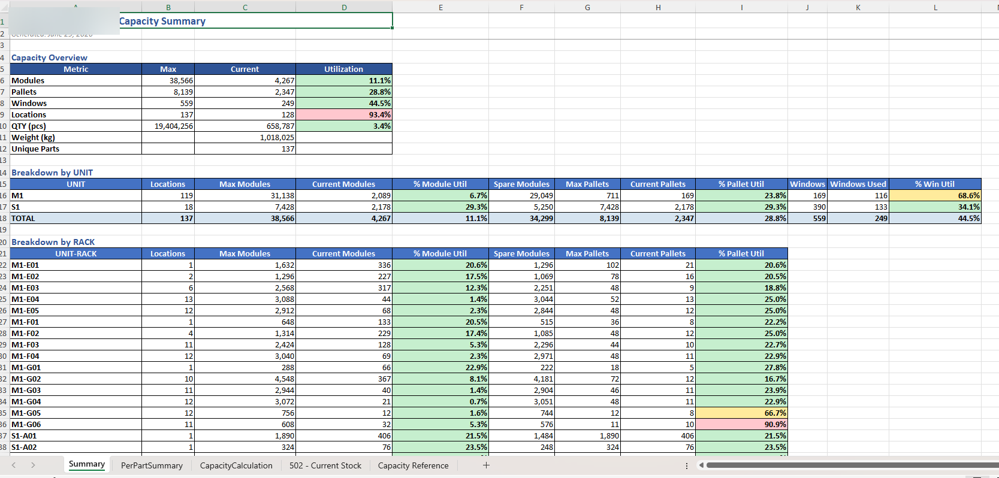

# Inbound Capacity Calculation



<sub>Capacity summary — module, pallet & window utilization by unit and rack</sub>

> _Report preview. Operational volume metrics are shown as generated; the employer, customer/supplier names, order/part identifiers, and employee names have been redacted or replaced with placeholders for this public portfolio._


## IN Capacity Calculation

Generates a multi-sheet Excel workbook that compares current stock against rack capacity for the Site 1 warehouse. Single-pass batch script — no tests, linter, or build step. Dependencies: `pandas`, `numpy`, `openpyxl`. Install with `pip install pandas numpy openpyxl`.

Source files in `Data/` are operator-refreshed exports and are overwritten before each run. They are not checked in.

## Entry point

[capacity_calculation v2.0.py](capacity_calculation%20v2.0.py) is the current/active script. [capacity_calculation.py](capacity_calculation.py) is the older version (joined 701 + 702 + 502; replaced because the rack-spec data now lives in the operator-maintained `Capacity Calculation.xlsx` instead of 701). Do not edit v1 when fixing bugs — port changes into v2.0.

```
python "capacity_calculation v2.0.py"
```

No CLI arguments. Output filename uses today's date (`IN_Capacity_Calculation_YYYYMMDD.xlsx`); re-running on the same day overwrites.

## Inputs (`Data/`)

- `Capacity Calculation.xlsx` (sheet `Capacity Calculation`) — **primary reference**. One row per (location, part) with rack geometry: `LOCATION`, `UNIT`, `RACK`, `POSITION`, `PRODUCT CODE`, `BOX TYPE`, `BOX STACK HEIGHT`, `BOX PER LAYER`, `PALLETS PER WINDOW`, `WINDOWS`, `QTY per box`, `Weight`, `Packaging Description`. The capacity formula and the universe of valid (location, part) pairs are both driven by this file.
- `502.csv` — current stock snapshot. `LOCATION` arrives in dashed form (`M1-G06-100-00`) and is normalized to undashed (`M1G0610000`) to match the Excel keys. `MODULE#` is used for module count; `QUANTITY` for piece count.
- `701.CSV` — item/part master used as a **fallback only**: provides `PCS/Module` (from its `PCS/BOX` column) when the Excel row has 0, and supplies `WEIGHT PER PCS` (kg) since the Excel only has lbs/box. NOTE: in the code this is loaded into variables named `df702` / `df702_raw` / `PCS_MODULE_702` — the names are a legacy artifact; the data comes from **701**, not 702.
- `702.CSV` — location/slot master (`UNIT`, `RACK`, `POSITION`, `LEVEL`, `PRODUCT CODE`). It does **not** carry `PCS/BOX` or `WEIGHT PER PCS`, so v2.0 does **not** read it. Leave the file alone; do not wire it in as the part-data fallback (doing so breaks the run — those columns don't exist there).
- `Site 1 Parts List.xlsx` (sheet `Parts List_IND`, header on row 4) — descriptions and Area lookup keyed on `Supplier Part No.`.

Both Excel files are opened with a `PermissionError` fallback that copies them to `%TEMP%` first — they are typically open in Excel during runs.

## Output

`Output/IN_Capacity_Calculation_YYYYMMDD.xlsx` with five sheets in this order:

1. **Summary** — capacity overview, over-capacity alerts, unassigned/mismatched stock, breakdowns by UNIT and UNIT-RACK, top-10 fullest, top-10 most spare, utilization-band distribution.
2. **PerPartSummary** — one row per part with `Assigned QTY` + `Overflow QTY` = `Total Current QTY`.
3. **CapacityCalculation** — full per-(location, part) detail, color-coded by utilization.
4. **502 - Current Stock** — raw passthrough.
5. **Capacity Reference** — raw passthrough of the input Excel.

## Capacity formula

```
Max Pallets = Windows × Pallets_per_window
Max Modules = Max Pallets × Modules_per_layer × Stack_height
Max QTY     = Max Modules × PCS/Module
```

`PCS/Module` resolves to `cap_ref.PCS_MODULE` if > 0, else the 701 `PCS/BOX` fallback (held in the legacy-named `df702` frame) — implemented as `PCS_FINAL`. `WEIGHT_PCS` (kg) always comes from 701.

> **Heads-up — `Max QTY` is theoretical.** `Max QTY = Max Modules × PCS/Module` assumes every module slot is packed brim-full of pieces, so the `% QTY Utilization` figure (e.g. ~3% warehouse-wide) is *not* a measure of how full the warehouse is. For operational fill, read the module/pallet/window/location utilizations instead.

## How 502 stock is bucketed

Stock is classified into three buckets before merging back into the capacity table:

- **Assigned** — `(LOCATION, PART_CLEAN)` matches a capacity-spec row. Flows through the left-join and counts toward location-level utilization.
- **Overflow** — `LOCATION[:5]` is in `OVERFLOW_LOCATIONS = {ECQPC, OVFLO, ZZZZZ, H1HLD, XXPIL}`. Legitimate stock with no rack capacity attached. Counted in per-part totals (`Overflow QTY` column on PerPartSummary) and in the Summary's QTY/weight totals — but NOT in module/pallet/window totals (those are rack-only).
- **Orphan** — neither. Surfaced as a red "Unassigned / Mismatched Stock" block on the Summary so it can't silently disappear.

If a new overflow code shows up in production, add its 5-char prefix to `OVERFLOW_LOCATIONS`. Otherwise it lands in the orphan block.

## Key gotchas

- **Part code matching** is done on `PART_CLEAN` (whitespace and hyphens stripped) — every cross-source merge keys on this, never on raw `PRODUCT_CODE`. New code added to this script that joins parts must do the same normalization.
- **Location format mismatch**: 502 uses dashes, the Excel uses no dashes. The `df502['LOCATION'].str.replace('-', '')` line on load is load-bearing — without it every row becomes an orphan.
- **Weight unit split**: Excel `Weight` column is lbs/box (display only, parsed by `parse_weight_lbs`); 701 `WEIGHT PER PCS` is kg/piece (used for the kg totals). Don't conflate them.
- **`LEVEL` is derived**, not read — it's the last 2 chars of `LOCATION` (always `00` in current data).
- **Path uses spaces and OneDrive** — always quote the script path on the command line. Filename has a space and a version (`v2.0`).
- `desktop.ini` is a Windows artifact — ignore.