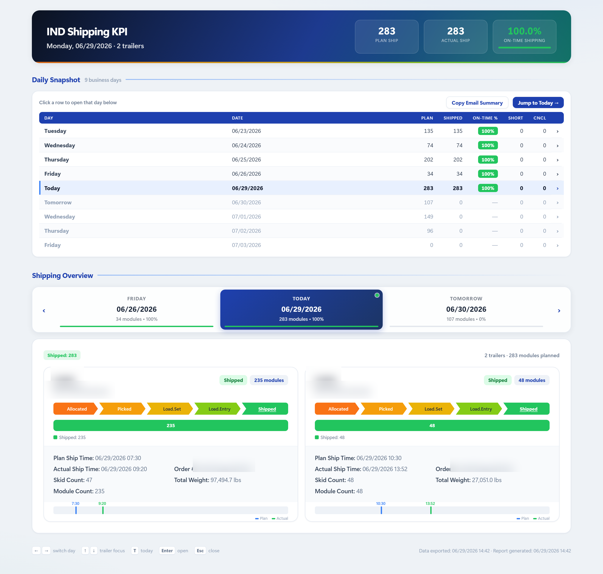

# Daily Shipping KPI



<sub>Daily Shipping KPI dashboard — full-page HTML report</sub>

> _Report preview. Operational volume metrics are shown as generated; the employer, customer/supplier names, order/part identifiers, and employee names have been redacted or replaced with placeholders for this public portfolio._


## IN Daily Shipping KPI

Generates a daily shipping KPI report (HTML + Excel + a PNG snapshot) for Example Logistics inbound shipping operations from four CSV exports. The PNG is an email-ready full-page screenshot of the report the operator drag-drops into the email body while attaching the HTML/Excel.

No test suite, no linter, no build/packaging step — run the script directly. Dependencies: `pandas` (uses `pandas.tseries.offsets.BDay`) and `openpyxl`. The PNG step is fail-soft and needs no pip package: it screenshots the HTML with headless Edge/Chrome (`_find_browser` checks the standard install paths); `matplotlib` is optional and only used for the fallback KPI-card snapshot when no browser is found. There is no `requirements.txt` / `pyproject.toml` in the repo; install with `pip install pandas openpyxl` (add `matplotlib` if the fallback matters).

Fresh CSV exports must be dropped into `Data/` before each run — the four files are not checked in and are overwritten by the operator from the source system.

## Entry point

`Shipping KPI V3.4.py` is the current/active script. `Shipping KPI V3.3.py`, `Shipping KPI V3.2.py`, `Shipping KPI V3.1.py`, `Shipping KPI V3.0.py`, `Shipping KPI V2.1.py`, `Shipping KPI V2.py`, and `generate_daily_shipping_kpi.py` are older versions kept for reference — do not edit them when fixing bugs; port changes into V3.4. (V3.1 = the V2.1 single-page layout — the sidebar/app-shell + day-modal redesign of V3.0 was rejected by the operator — plus V3.0's email-snapshot PNG, the **Daily Snapshot** 9-day overview table, the dark-mode toggle, and the shared `_pct_color` / `_day_label` / `_cell_int` helpers. V3.2 = V3.1's layout and data logic with a UI redesign: all colors/shadows live as CSS variables in `:root` (V3.1's dark mode/toggle was removed at the operator's request); the day tabs sit in a **sticky** `.tabs-wrap` bar with the Prev/Next arrows inside the strip; each tab carries a thin ship-ratio progress strip; the Daily Snapshot row of the selected day stays highlighted via `ov-sel`; `stepDay` lets ←/→ keys and phone swipes cross page boundaries; the header gains a ratio progress bar + trailer count and the footer shows keyboard hints. V3.3 = V3.2's layout and data logic plus an operations pass: **late-shipment detection** (`late_min` per trailer in `compute_summary1` — actual load vs first planned time, same comparison the card timeline colors by — drives Unassigned/Late day chips and a Ship Delay row in the modal; the per-card "Late +1h05m" badge, an On-Time trend sparkline, and vs-previous-day hero/PNG delta chips were built and then **removed at the operator's request** — don't reintroduce them); a **Copy Email Summary** button (`copySummary` / `buildEmailSummary` — reproduces the original `generate_daily_shipping_kpi.py` email body **byte-for-byte**: `<h1>` title + "KPI per status module/order count" (`LEGACY_SUMMARY2_HEADERS`) + per-day "KPI per Trailer/BOL" (`LEGACY_SUMMARY1_HEADERS`) tables for the selected day ±1 business day, copied as rich HTML with a tab-separated plain-text alternative; the data is embedded as `S2`/`S1` next to `DS`); Unshipped **Export CSV** (`exportUnshippedCSV`, respects active filters) and **overdue highlighting** (planned ship time before `GEN_TS`, the report-generation timestamp); `validate_inputs` (`REQUIRED_COLUMNS`) preflight with readable errors; `data_freshness` stamp in the footer + stale warning when inputs are >12h old; a styled Excel workbook with a second **Daily_Summary** sheet; a 9-day console recap after each run; `T` key = jump to today; and an `--open` flag. V3.4 = V3.3's data logic and layout plus a delivery pass: the PNG is now a **full-page screenshot of the finished HTML report** (`write_report_screenshot` — headless Edge/Chrome found by `_find_browser`, two passes: a `--dump-dom` load that reads back a probe-injected `data-shot-h` page height, then the capture at that height with `--force-device-scale-factor=2`; `write_snapshot_png` is the matplotlib fallback when no browser exists or the capture fails); **Copy Email Summary also opens the summary in a new tab** (`openSummaryTab`, blob URL — wrapper styling only, the clipboard payload stays the untouched legacy markup); and a **passive phone layout** for the Outlook attachment preview, where no JS runs: at ≤600px `html:not(.js)` hides the dead tab strip / row-tap chevrons / filter controls, each `dpanel` carries a `.dp-title` static day title (hidden whenever JS is on), today's Unshipped rows are pre-rendered server-side (`_render_unshipped_rows` / `_plan_ship_overdue` mirror the JS `renderUnshipped` / `planTs` exactly, and the section ships visible iff today has rows), and phone-width overflow sources were fixed (single-column `.tc-meta`, side-scrolling `.ov-snap`, `body{overflow-x:hidden}` guard).)

```
python "Shipping KPI V3.4.py"                       # report for today, 9 business days centered on today
python "Shipping KPI V3.4.py" --date 2026-04-27     # center the 9-day window on a specific date
python "Shipping KPI V3.4.py" --dates 2026-02-12 2026-02-13 2026-02-16   # exact 3-date override
python "Shipping KPI V3.4.py" --data-dir <path> --output <path>
python "Shipping KPI V3.4.py" --no-png              # skip the PNG snapshot (HTML + Excel only)
python "Shipping KPI V3.4.py" --open                # open the HTML report in the browser afterwards
```

## Inputs (`Data/`)

All four files are CSVs read as `dtype=str`; date/time parsing is handled in code.

- `201S.csv` — shipped/in-progress order status (CUSTOMER ORDER NO., STATUS, SHIP DATE, SHIP TIME, UC/CNL).
- `201P.csv` — planned but not-yet-processed orders (used for the "1.No process" bucket and shortage/cancel counts).
- `202.csv` — module-level plan with stage timestamps (PLAN SHIP DATE/TIME, PICKING, LOADING SET, LOADING ENTRY, SHIPMENT LOAD).
- `210.csv` — trailer/BOL assignments per module (Module No, Trailer#, Bol, Skid No, Weight, Boxes, supplier short name).

A module is considered **shipped** when it has a non-empty `Trailer#` in `210.csv` (not by status string). Stage of an unshipped module is derived from which timestamp columns are populated in `202.csv` (latest populated stage wins: Load.Entry > Load.Set > Picked > Allocated).

## Outputs

- `Output/HTML/Site1_Shipping_KPI_YYYYMMDD.html` — main report, a **single-page dashboard** (`build_html`), top to bottom: a gradient **header** with hero KPIs (Plan / Actual / On-Time Shipping — the ship ratio is labeled "On-Time Shipping" in the hero and "On-Time %" in both 9-day tables; animated counters that retarget to whichever day is selected); the **Daily Snapshot** section (`render_overview_table` — the 9-business-day table mirroring the PNG; each row carries a `›` affordance and `jumpToDay(i)` switches the tab below and scrolls to it, plus a "Jump to Today" button); the **Shipping Overview** section (`id="ship-sec"`) with **day tabs** (3 per page, Prev/Next arrows built into the sticky tab strip, today centered, per-tab ratio strip) over an **inline day panel** per day (stage/alert chips + trailer cards — `dpanel`, toggled by `showDay`; the panel-level stage bar was removed in V3.2 at the operator's request — the PNG keeps its stage bar); and the **Unshipped Orders** table, shown only for the selected day when it is today/past and has rows (`updateUnshippedForDay` / `renderUnshipped`, text + status filters, sortable headers, stage-colored status dots; today's rows are pre-rendered server-side since V3.4 so the table also reads without JS). Clicking a trailer card opens the trailer-detail modal (`openModal`, sortable/filterable module table). Keyboard: ←/→ day, ↑/↓ card focus, Enter opens, Esc closes; phones get a touch-swipe day flip and bottom-sheet modal. The header, snapshot table, tabs, today's panel, and today's unshipped rows all render without JS (Outlook preview / print); JS-only controls (pagination arrows, Jump-to-Today, filters) hide themselves via `html:not(.js)`, and at phone widths the no-JS view goes further (V3.4 passive phone layout: tab strip hidden, static `.dp-title` day title, no tap affordances).
- `Output/Excel/Site1_Shipping_KPI_YYYYMMDD.xlsx` — `Unshipped_List` sheet (first/active; raw source-system column headers from `UNSHIPPED_HEADERS` — the HTML table shows the prettified `UNSHIPPED_DISPLAY_HEADERS` instead; styled header, freeze pane, autofilter, numeric Qty/Modules) plus a `Daily_Summary` sheet added in V3.3 (the 9-day snapshot table, today's row highlighted, On-Time as a real percent cell, blank for future days).
- `Output/PNG/Site1_Shipping_KPI_YYYYMMDD.png` — email-ready image. Since V3.4 this is a **full-page screenshot of the HTML report** written by `write_report_screenshot` (headless Edge/Chrome, 1400px wide at 2x scale, full measured height — so it shows exactly what the report shows: header, Daily Snapshot, today's panel with trailer cards, unshipped table if present). Falls back to `write_snapshot_png` (matplotlib: dark header band, 3 KPI cards, today's stage bar, 9-day table) when no browser is found or the capture fails. Skipped by `--no-png`.

The `YYYYMMDD` in filenames is the center date (`date2`), not today's date when `--date` is passed.

## Key concepts in the code

- **Status → bucket map** (`STATUS_BUCKET_MAP` at top of file): maps the truncated 10-char STATUS strings from 201S (`Load.Conf*`, `Pick & ski`, `Tmp.Traile`, etc.) to internal bucket names. If you see a new status string in production data, add it here — unknown statuses fall into "other" and silently disappear from Summary2 counts.
- **9-business-day window**: `resolve_dates` builds `BDay(-4)` through `BDay(+4)` around `date2`. Weekends/holidays handled by pandas `BDay`, not a custom calendar.
- **Stage rendering**: `STAGE_COLORS` and `STAGE_CSS_CLASS` drive HTML coloring; keep them in sync with `STAGE_NAMES`.
- **Trailer normalization**: `normalize_trailer` strips `#` and whitespace. Missing trailer or BOL becomes the literal string `N/A` for grouping.
- **Snapshot ⇆ HTML parity**: the primary PNG is now a screenshot of the HTML itself, so it can't drift. The parity rule survives for the **matplotlib fallback**: `write_snapshot_png` and the HTML (header hero + `render_overview_table`) read the same already-computed `summary2_rows` / `summary1_blocks` (no recomputation) and share helpers `_pct_color` (green/amber/red ≥80/≥50/else), `_day_label` (Yesterday/Today/Tomorrow/weekday; `short=True` for tight cells), and `_cell_int`. Change a number/threshold in one place and update both renderers. Future days deliberately show `—` (not a red 0%) for ratio until the ship day arrives. Same idea JS⇆Python: `_render_unshipped_rows` / `_plan_ship_overdue` / `UNSHIPPED_STATUS_COLORS` must keep matching `renderUnshipped` / `planTs` / `USC`.
- **V3.0's app shell was rejected**: the operator prefers the single-page tab layout — don't reintroduce the sidebar/section views or move day detail back into a modal. New sections (e.g. Receiving) should be added as a new `<div class="sec">` block on the same page, following the Daily Snapshot / Shipping Overview pattern.

## Excel Manual Way/

Reference folder containing the legacy Excel-based workflow this script replaces. Not used at runtime — useful only when reconciling output discrepancies against the manual process.

## Gotchas

- CSVs are read as strings; any numeric/date logic must go through `clean_date_column`, `combine_datetime`, or explicit `float()` casts (see weight/box totaling in `compute_summary1`).
- `desktop.ini` and `__pycache__/` are Windows/Python artifacts — ignore.
- The `Boxes` column in `210.csv` actually holds **piece quantity** per module — it is summed into `total_qty` and shown as "Quantity"/"Total Quantity" in the trailer modal; the trailer card's meta footer shows Module Count instead.
- Time strings in source data use `.` as the H/M separator (e.g. `14.30`); `clean_time_column` rewrites these to `:` before datetime parsing.
- Path uses spaces and OneDrive — always quote the script path on the command line.
- "Late" everywhere means *the trailer shipped on a later **date** than planned* — `is_late = actual_load_max.date() > plan_min.date()` in `compute_summary1`. An intraday delay on the planned day (e.g. 07:30 plan, 09:38 actual) is **on time**; only a missed ship day counts. `is_late` is the single source of truth shared by the "Late: N trailer(s)" day chip (a **trailer** count, not modules — it sits among module-count stage chips, so it carries the unit), the red timeline marker (`_render_timeline` takes `is_late`; the bar still plots time-of-day, so a same-day late-in-the-day actual marker is *not* red), and the modal Ship Delay row (`data-islate` → `d.islate`). `late_min` is kept only as the delay *magnitude* shown when late (`fmtDur`, now day-aware). Keep all three on `is_late`. (Earlier versions used a time-of-day comparison against `plan_min`; the operator changed it to date-based — same-day shipments are on time.)
- The Unshipped "overdue" highlight compares against `GEN_TS` (when the report was generated), not the viewer's clock — the report is a data snapshot.
- **Never put a literal `</body>` (or other closing-tag text) inside the inline JS** — write `<\/body>` like `openSummaryTab` does. The screenshot probe is injected before the *last* `</body>` (`rpartition`), but an earlier literal once broke the whole script block mid-page.
- Headless Edge/Chrome on Windows enforce a ~470px minimum viewport (and shave ~30px from `--window-size`), so phone layouts can't be screenshot-tested by passing a narrow window — override the meta viewport to `width=390` in a throwaway copy instead.