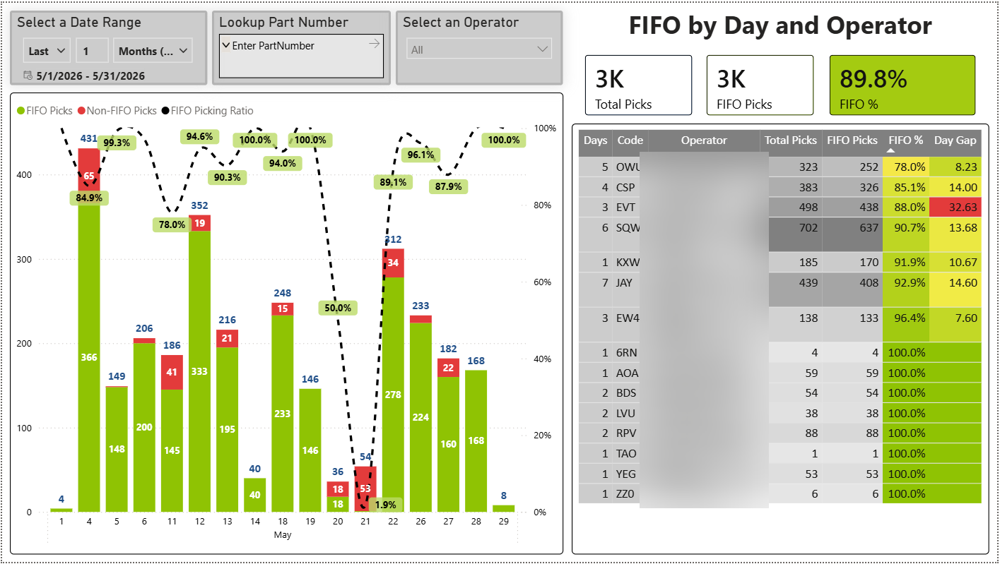

# FIFO KPI — Weekly Email Insights

Power BI — FIFO pick compliance by day and operator

> _Report preview. Operational volume metrics are shown as generated; the employer, customer/supplier names, order/part identifiers, and employee names have been redacted or replaced with placeholders for this public portfolio._

## Purpose

This project produces FIFO compliance data for the Site 1 warehouse (Example Logistics). The analyzer (`indiana_fifo_analyzer v2.0.py`) runs weekly and writes CSVs to `./Power BI Data/`. Once a week the user asks Claude Code to generate a leadership-facing **email body** summarizing the latest data. That email body is then pasted into Outlook with the report attached.

When the user types any of these phrases (or close variants), follow the procedure in this file and produce a ready-to-paste markdown email body:

- "generate the weekly FIFO email"
- "weekly FIFO insights"
- "FIFO email"
- "generate insights"
- "weekly report email"

Do **not** run the Python script. Assume the CSVs are already fresh (the user runs the script before asking).

---

## Data files (in `./Power BI Data/`)

| File | What it contains |
|---|---|
| `PowerBI_PickDetails.csv` | One row per pick. Columns: `ProcessTime, OperationDateTime, OperationDate, Shift, HourOfDay, OperatorCode, OperatorName, PartNumber, ModuleNumber, OldestAvailableDate, PickedModuleDate, FIFO_Pick, SessionId`. `OldestAvailableDate` is the oldest vanning date of the part **at end of operation day** (from the next-morning 502 snapshot); blank means the part was gone from that snapshot. `FIFO_Pick` is 1/0 or blank (blank = unresolvable date). |
| `PowerBI_DailySummary.csv` | `Date, FIFO_Picks, Total_Picks, Non_FIFO_Picks, FIFO_Ratio` |
| `PowerBI_ShiftSummary.csv` | `Date, Shift, FIFO_Picks, Total_Picks, Non_FIFO_Picks, FIFO_Ratio` |
| `PowerBI_PartSummary.csv` | `PartNumber, FIFO_Picks, Total_Picks, FIFO_Ratio, First_OldestLocation, First_OldestModuleNumber` |
| `PowerBI_OperatorSummary.csv` | `OperatorName, OperatorCode, FIFO_Picks, Total_Picks, Non_FIFO_Picks, FIFO_Ratio` |
| `PowerBI_HourlySummary.csv` | `Hour, FIFO_Picks, Total_Picks, Non_FIFO_Picks, FIFO_Ratio` |
| `PowerBI_OperatorTimeline.csv` | Session-level Gantt data (one row per work session) |
| `PowerBI_OldestLocationByPart.csv` | `PartNumber, OldestLocation, OldestVanningDate, OldestModuleNumber` |
| `Current_Inventory_Overview.xlsx` | Latest 502 snapshot — use only if asked about forward-looking risk |

---

## Domain glossary

- **FIFO compliance (End-of-Day, 5-day grace)**: For each `(part, operation_day)`, the analyzer loads the **next morning's 502 snapshot** and finds the oldest vanning date of that part *still on the shelf at end of day*. A pick is FIFO-compliant if `picked_vanning_date − EOD_oldest_vanning_date ≤ 5 days`. This means same-day picks where the operator picked a newer module in the morning and the older one later in the day both pass — by the time the next-morning snapshot is taken, both are gone. If a part has no modules left in the next-morning snapshot, all that day's picks of it are trivially FIFO. `FIFO_Pick = 1` means compliant; `0` means non-compliant; **blank/NA** means unresolvable (no vanning date) — these are excluded from `FIFO_Ratio`.
- **Vanning date**: Manufacturing / dispatch date. Source priority: (1) module-number encoding, (2) `ETA` from the inventory snapshot, (3) `ARRIVAL DATE`. Encoding schemes:
  - **DateTable1** (Japan) — prefixes `KJ699`, `KJ900`, `KJ999`, `22200`, `26700`, `27100`, `2Z400`, `2G400`, `WN000`, single-letter `S`/`K`. Encodes year+month only; day defaults to 1 (~9-day systematic skew vs label).
  - **DateTable2** (Mexico/China/Canada) — `KJ540`, `KJ55x`, `KJ56x`, `KJ57x`, `KJ59x`, `KJ61x`–`KJ69x`, `KJ912`, plus `KA079`, `KA125`, `KA184`, `KA255`, `KA277`. Encodes year+month only; day defaults to 1. Also serves as a "no-encoding, use fallback" bucket for the KA-catchall prefixes below.
  - **DateTable3** (Thailand) — `KJ911`, `KA085`, `KA118`, `KA152`, `KA158`, `KA199`, `KA224`, `KA261`, `KA296`, `KA331`. Year+month encoded with a 2-month EDATE offset. **Strict**: returns None when month digits aren't valid `01–12` (no longer defaults to mid-year).
  - **MNA encoding** — modules with `MNA` at positions 4-6 use full year+month+day encoding. Verified accurate to the day against warehouse labels.
  - **KA-catchall (ETA-50d)** — `KA120, KA216, KA246, KA267, KA357, KA359, KA361, KA363, KA365, KA367, KA369, KA371, KA373, KA374`. The barcode does **not** encode the vanning date for these; the analyzer uses `ETA` minus 50 days as a proxy (warehouse-label sampling on 2026-05-11 showed ETA runs ~50 days after the printed S DATE). Mean abs error ~14 days. Class constants `ETA_OFFSET_PREFIXES` and `ETA_OFFSET_DAYS` in `FIFOAnalyzer` control this.
- **Shifts**: Shift 1 = 06:00–16:30. Shift 2 = the rest. Shift 2 picks before 06:00 belong to the **previous** OperationDate (already handled in the data).
- **Sessions**: A new session starts on operator/shift/date/FIFO-state change, or after a 15-minute idle gap. Every session is purely FIFO or purely Non-FIFO.
- **Older = should be picked first.** A non-FIFO pick means a newer module was scanned, AND a >5-day-older module of the same part was **still on the shelf at end of day** (i.e., it didn't ship out that same day).

---

## Email body structure (the deliverable)

Output a single markdown block with these sections, in this order:

1. **Subject line** — one line, e.g. *"Weekly FIFO KPI — Wk of YYYY-MM-DD — XX.X% compliance (▲/▼ Xpp)"*
2. **Headline** — one sentence with the key number and direction vs the prior week.
3. **Compliance summary** — a compact 3-row block:
   - This week: `XX.X%` (`FIFO/Total`)
   - Prior week: `XX.X%` (`FIFO/Total`)
   - Delta: `±X.X pp`
4. **What drove the change** — 2–4 tight bullets. Tie each to a visible pattern in the data (a shift, a part family, a location, an operator). No speculation.
5. **Top 3 problem parts** — markdown table with: `PartNumber | FIFO_Ratio | Total_Picks | OldestLocation | OldestModule | Suggested action`. Pick the 3 parts with the lowest FIFO_Ratio that have **≥ 10 total picks** this week (filter low-volume noise).
6. **Operator highlights** — 1 line each:
   - **Top performer** — highest FIFO_Ratio with ≥ 30 picks
   - **Most improved** — biggest positive week-over-week delta with ≥ 30 picks both weeks
   - **Most slipped** — biggest negative week-over-week delta with ≥ 30 picks both weeks
7. **Recommended actions** — 3–5 prioritized, concrete actions. Each must reference a specific part / module / location / operator from the data. Examples of the right shape:
   - "Relocate module `KJ55012345MNA0301` from `B-45-3` to an A-zone slot — 8 of 12 non-FIFO picks for this part traced back to that rack."
   - "Coach operator J. Smith on Thailand-origin parts (`KA118*`) — FIFO ratio dropped 18 pp this week."
   - "Audit rack `B-45` — appears in 3 of the top 5 problem parts."
8. **Footer** — time window covered (date range), files used, "generated YYYY-MM-DD".

---

## Procedure

1. Read `PowerBI_DailySummary.csv` to find the latest date and define the windows:
   - **This week** = the last 7 distinct OperationDates present in the data.
   - **Prior week** = the 7 OperationDates immediately before that.
2. Read `PowerBI_PickDetails.csv` once for week-over-week aggregates (it's the source of truth for both windows).
3. Compute (treat rows with blank `FIFO_Pick` as **excluded**, not as Non-FIFO):
   - Overall FIFO ratio for each window — `FIFO_Picks / Total_Picks` where `Total_Picks` already counts dated picks only
   - Per-part FIFO ratio for the current window (filter `Total_Picks ≥ 10`)
   - Per-operator FIFO ratio for both windows (filter `Total_Picks ≥ 30` in **both** windows for delta callouts)
   - Per-shift split for the current week (to spot Shift-1-vs-2 patterns)
   - If a meaningful share of picks (>20%) is unresolvable for the current week, note it in one line of the email so leadership knows the denominator
4. Cross-reference problem parts with `PowerBI_OldestLocationByPart.csv` (or `First_OldestLocation` in `PowerBI_PartSummary.csv`) to attach a physical location to each suggested action.
5. For "what drove the change", scan for: a shift skewing the average, an operator with disproportionate non-FIFO picks, a single rack/zone showing up across multiple problem parts, or a part family (by prefix → origin) over-represented.
6. Output the email body as one markdown block. Do **not** save it to a file unless the user asks.

---

## Tone & length

- Professional, leadership-friendly, concise. Target **250–400 words** total.
- No filler, no hedging ("might", "perhaps") unless the data genuinely warrants it.
- Numbers come from the CSVs — never invent or estimate. If something can't be computed (e.g. prior week missing), say so in one line and continue.
- Use part numbers, module numbers, locations, and operator names **exactly** as they appear in the data.
- Bullets over paragraphs. Tables for comparisons.

---

## What not to do

- Don't run the Python script. The user runs it before asking.
- Don't write new files unless the user explicitly asks. Print the email body in chat.
- Don't speculate about root cause without a visible pattern. Every causal claim must cite a number, a location, or an operator from the data.
- Don't include operators or parts that fail the volume thresholds — they create noise and get challenged.
- Don't pad the email with generic FIFO theory. The audience knows what FIFO is.