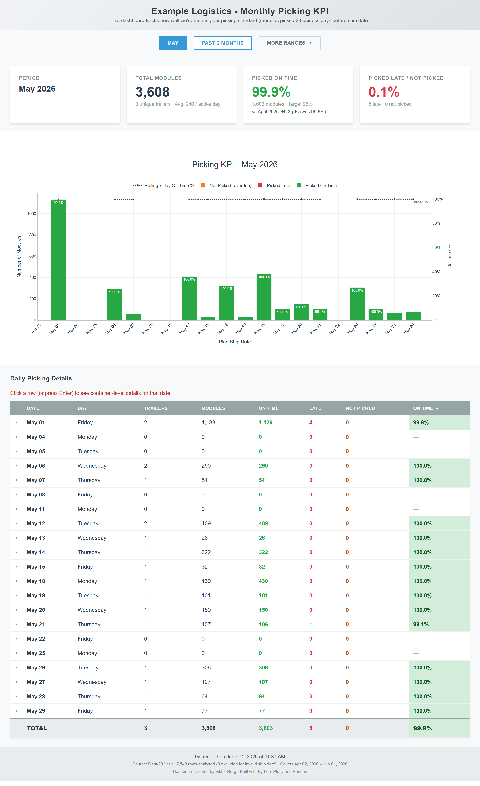
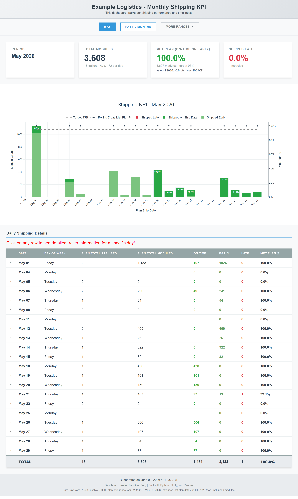
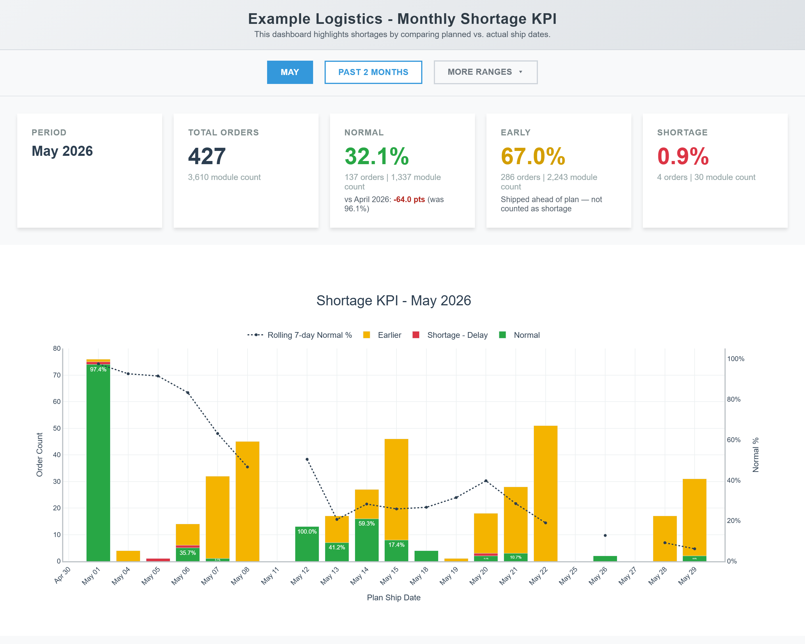

# Monthly KPIs (Picking, Shipping, Shortage)



<sub>Monthly Picking KPI</sub>



<sub>Monthly Shipping KPI</sub>



<sub>Monthly Shortage KPI</sub>

> _Report preview. Operational volume metrics are shown as generated; the employer, customer/supplier names, order/part identifiers, and employee names have been redacted or replaced with placeholders for this public portfolio._


## Purpose

Three independent monthly KPI report generators for Example Logistics inbound operations: **Picking**, **Shipping**, and **Shortage**. Each script reads CSV exports from `Data/` and writes a self-contained interactive HTML report (Plotly + custom JS) in the working directory.

## Entry points

Active scripts in [Scripts/](Scripts/):

- **Picking**: `monthly_picking_kpi_v2.0.py`
- **Shipping**: `monthly_shipping_kpi_v2.0.py` *(new — adds 3-way bucket Early/On-Time/Late, MoM delta, rolling 7-day met-plan % line + 95% target, DoW breakdown, defensive loading with `load_info` footer)*
- **Shortage**: `monthly_shortage_kpi_v2.0.py` *(new — rolling 7-day Normal % line on a secondary axis (no horizontal target yet — `TARGET_PCT = None` hook left in place), MoM Normal-% delta on the headline card, DoW grid, defensive loading with `load_info` footer, distinct-order count via `nunique('CUSTOMER ORDER NO.')` while line-item totals are renamed `*_lines` in `daily_summary`

```bash
# Run from the repo root so default --data-folder=Data resolves correctly.
python Scripts/monthly_picking_kpi_v2.0.py                       # current month
python Scripts/monthly_picking_kpi_v2.0.py --month 2 --year 2026 # specific month
python Scripts/monthly_shipping_kpi_v2.0.py --month 2 --year 2026
python Scripts/monthly_shortage_kpi_v2.0.py --month 2 --year 2026
python Scripts/<script>.py --data-folder <other-path>
```

All three accept the same flags: `--data-folder` (default `Data`), `--month`, `--year`. Output filename pattern: `{Picking,Shipping,Shortage}_KPI_Report_YYYY_MM.html` written to the cwd. Archived monthly outputs live in folders like [February 2026/](February 2026/).

Dependencies: `pandas`, `plotly`, `numpy`. No `requirements.txt` is checked in.

## Inputs ([Data/](Data/))

- [Data/202.csv](Data/202.csv) — module-level plan with stage timestamps. Required by **picking** (uses `PLAN SHIP DATE`, `PICKING DATE/TIME`, `TRAILER NO`, `TEMP.TRAILER`, `MODULE NO`) and **shipping** (uses `PLAN SHIP DATE`, `SHIPMENT LOAD DATE`, `QTY`).
- [Data/201S.csv](Data/201S.csv) — order-level shipped/in-progress export. Required by **shortage** (uses `CUSTOMER ORDER NO.`, `PRODUCT NO.`, `SHIP DATE`, `QUANTITY`, optionally `PLAN SHIP DATE`, `STATUS`, `UC/CNL`). The shortage script also opportunistically reads `202.csv` to count modules per order.

The shortage script falls back to legacy column names (`ORDER NO`→`CUSTOMER ORDER NO.`, `PARTS NO`→`PRODUCT NO.`, `QTY`→`QUANTITY`, `SHIPMENT LOAD DATE`→`SHIP DATE`) and parses `PLAN SHIP DATE` from positions 8–16 of `CUSTOMER ORDER NO.` when not provided as a column.

## KPI semantics — read before changing date/on-time logic

Each script defines "on time" differently and they are **not interchangeable**:

- **Picking** ([monthly_picking_kpi_v2.0.py](Scripts/monthly_picking_kpi_v2.0.py)): on-time means `PICKING DATE <= PICKING DUE DATE`, where due date is `PLAN SHIP DATE - 2 business days` using a custom calendar (`_COMPANY_BDAY`) that excludes US federal holidays **and the company year-end shutdown Dec 23 – Jan 2** (`_build_company_holidays`). The 2-business-day offset is the core SLA — don't change it without confirming with the user. Modules are filtered to those whose due date is `<= today`; unpicked rows are flagged `NOT_PICKED_OVERDUE`. Target = 95% (`ON_TIME_TARGET_PCT`).
- **Shipping** ([monthly_shipping_kpi_v2.0.py](Scripts/monthly_shipping_kpi_v2.0.py)): on-time means `SHIPMENT LOAD DATE == PLAN SHIP DATE` (exact-day match); earlier is tracked as `EARLY` and rendered as its own stacked bar / stat card. The headline KPI is `met_plan_pct = (on_time + early) / total`, compared against `ON_TIME_TARGET_PCT = 95.0` via a horizontal target line and a rolling 7-day line. The script also drops the **last plan date entirely if any module on it is still unshipped**, to avoid showing a partial-day result as a miss (surfaced in the load_info footer when it triggers). `total_trailers` deliberately counts trailer-load **events** (sum of daily classifications), not unique chassis — many sites recycle 1–2 trailer numbers daily so `nunique` would be misleading.
- **Shortage** ([monthly_shortage_kpi_v2.0.py](Scripts/monthly_shortage_kpi_v2.0.py)): classifies each order as `normal` / `delay` / `early` / `not_shipped` based on `SHIP DATE` vs `PLAN SHIP DATE`. Cancelled rows (`STATUS` contains "cancel" or `UC/CNL` contains "cnl") are dropped. Duplicate `(CUSTOMER ORDER NO., PRODUCT NO.)` pairs are **aggregated, not deduped** — `SHIP DATE` takes max, `QUANTITY` is summed (partial shipments must contribute their qty). Filter cutoff is `today - 1 day`. Headline KPI is `normal_pct = normal_lines / total_lines` (line-based) shown next to a distinct-order count (`nunique('CUSTOMER ORDER NO.')`); shortage = delay + early + not_shipped (one consistent definition across stats, daily summary, and chart). Rolling 7-day Normal % is plotted on a secondary y-axis; horizontal target line is intentionally disabled — re-enable by setting `TARGET_PCT = 95.0` (or similar) at the top of the script.

## Report architecture

Each `create_html_report` function emits a single HTML file with two embedded Plotly figures (`fig_month`, `fig_past2months`) plus inline JS that toggles between **Calendar Month** and **Past 2 Months** views. Shipping and shortage both add a third **Custom Range** view rendered client-side from a JSON blob of per-day data; shortage uses `_safe_json` (which escapes `</` to prevent script-tag breakout). When extending interactivity, follow that pattern — the embedded JSON must be JSON-safe inside a `<script>` tag. Picking v2.0, Shipping v2.0, and Shortage v2.0 all embed a secondary y-axis line (`yaxis='y2'`) for the rolling 7-day on-time / met-plan / Normal percentage; picking and shipping draw a dashed `ON_TIME_TARGET_PCT = 95%` reference line, while shortage intentionally omits the target line until the business agrees on a number (toggle with the `TARGET_PCT` constant).

`fill_missing_dates*` helpers pad date ranges with zero rows on business days only, so visual gaps reflect weekends/holidays rather than missing data. The picking script uses `_COMPANY_BDAY` for padding too; shipping and shortage use plain pandas `freq='B'`.

## Gotchas

- Scripts default to writing the HTML into the **current working directory**, not `Scripts/` or a dated subfolder. Run from the repo root and move the output into the relevant `<Month YYYY>/` archive folder afterwards.
- `desktop.ini` and `Scripts/__pycache__/` are Windows/Python artifacts — ignore.
- Path contains spaces and lives under OneDrive — always quote it on the command line.
- `Picking_KPI_Report_2026_03.html` at the repo root is the in-progress current-month report; archived months are inside `<Month YYYY>/` subfolders.
- Picking v2.0, Shipping v2.0, and Shortage v2.0 all use `[OK]` in their final stdout line to avoid emoji mangling in non-UTF-8 Windows consoles. The legacy un-suffixed scripts still print `✅` — don't standardize them blindly.