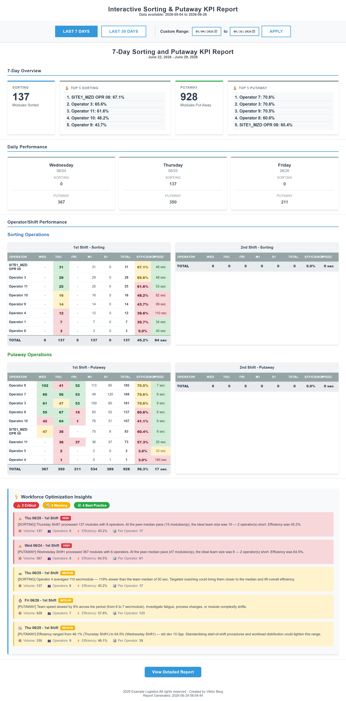

# Inbound Sorting KPI



<sub>Interactive sorting & putaway report with data-driven operator efficiency scoring</sub>

> _Report preview. Operational volume metrics are shown as generated; the employer, customer/supplier names, order/part identifiers, and employee names have been redacted or replaced with placeholders for this public portfolio._


## Projects in This Workspace

Two KPI reporting tools for the IN (inbound) warehouse at Example Logistics:

- **IN Sorting KPI** (`Scripts/sorting_pipeline 1.1.py`) — operator performance reports for module sorting and putaway
- **IN Daily Shipping KPI** (`../IN Daily Shipping KPI/Shipping KPI V2.1.py`) — daily shipment status and unshipped-list reports

Both are monolithic single-file Python scripts. There are no tests, no package structure, and no build steps.

## Running the Scripts

**Sorting KPI** (interactive CLI — prompts for date range on launch):
```
python "Scripts/sorting_pipeline 1.1.py"
```

**Shipping KPI** (defaults to today; use `--date` to override):
```
python "Shipping KPI V2.1.py"
python "Shipping KPI V2.1.py" --date 2026-04-25
python "Shipping KPI V2.1.py" --dates 2026-04-23 2026-04-24 2026-04-25
python "Shipping KPI V2.1.py" --base-dir "C:/path/to/dir"
```

## Dependencies

```
pip install pandas numpy plotly scikit-learn openpyxl
```

Sorting pipeline degrades gracefully when `plotly` or `scikit-learn` are absent (ML forecasting and Plotly charts are skipped). Shipping KPI requires `openpyxl`.

Python 3.13 is in use.

## Data Flow — Sorting KPI

Data is exported from the AS400 WMS system and dropped into `Data/` before each run.

| File | Purpose |
|---|---|
| `SORTING_MODULE_LIST.csv` | Raw sorting scan events (the "810" file) |
| `PUTAWAY_UNIT_LIST.csv` | Putaway scan events |
| `PUTAWAY_CONTAINER_LIST.csv` | Container-level putaway (supplementary) |
| `102.csv` | Module master — used to classify modules as Mix/Solid |
| `502.csv` | Receiving data (loaded but not yet used in scoring) |

Operator names are resolved from an Excel file outside this repo:
`./config/scanner_barcode.xlsx`
(the pipeline continues without it if absent).

**Pipeline steps** (inside `main()`):

1. Load config from `Output/kpi_config.json` (falls back to `Config` class defaults)
2. Interactive date range selection (menu choices 1–8; option 8 = all-data interactive HTML)
3. `process_sorting_data` → `calculate_sorting_speed_metrics`
4. `process_putaway_data`
5. `calculate_dynamic_benchmarks` — derives p25/p75 speed benchmarks from the loaded dataset
6. `aggregate_daily_metrics` — joins sorting + putaway, computes per-operator daily efficiency scores
7. `analyze_operator_performance`, `calculate_daily_efficiency_trend`, `predict_daily_volumes`, `analyze_workforce_optimization`
8. HTML report generation: single-day → `generate_daily_html`; multi-day → `generate_email_content` + embedded Plotly dashboard
9. Output saved to a subfolder of `Output/` (Daily/, Weekly/, 30-Day/, All Data/, Custom/)

## Efficiency Scoring (Sorting KPI)

Efficiency is a weighted blend of two components:
- **Speed score** — sigmoid over the operator's median scan-interval vs. team p25/p75 (`_speed_score`)
- **Throughput score** — logistic curve vs. peer-median daily volume (`_throughput_score`). There is no fixed daily target; the formula is fully data-driven. `Config.FALLBACK_DAILY_VOLUME` is a numerical scale used only when a peer median can't be derived (<3 operator-days in the dataset).

Weights are throughput-leaning by default: sorting `SORT_SPEED_WEIGHT` (0.35) / `SORT_THROUGHPUT_WEIGHT` (0.65); putaway `PUTAWAY_SPEED_WEIGHT` (0.25) / `PUTAWAY_THROUGHPUT_WEIGHT` (0.75) plus an additive `PUTAWAY_DIFFICULTY_BONUS`.

Optional Bayesian shrinkage (`SHRINKAGE_K`) pulls low-sample-size scores toward the team median.

Adjusting these weights is the most common tuning task — change them in `Config` or persist via `kpi_config.json`.

## AS400 Timestamp Format

Raw timestamps are 12-digit strings: `YYYYMMDDHHMM` (sometimes stored as a float in scientific notation). Parsed by `parse_timestamp()`. Operation dates roll back one calendar day for scans before 05:30 (to handle overnight shifts correctly).

## Data Flow — Shipping KPI

Input CSVs in `Data/`: `201S.csv` (shipped orders), `201P.csv` (plan), `202.csv` (detail/status), `210.csv` (trailer/BOL).

Shipping status pipeline: `Allocated → Picked → Load.Set → Load.Entry → Shipped` (mapped in `STATUS_BUCKET_MAP`).

The report covers a 9-business-day window centered on the target date. Outputs:
- HTML report → `Output/HTML/Site1_Shipping_KPI_YYYYMMDD.html`
- Unshipped list → `Output/Excel/Site1_Shipping_KPI_YYYYMMDD.xlsx`

## Configuration (Sorting KPI)

`Config` class at the top of the script holds all tunable parameters. Key ones:

| Parameter | Default | Meaning |
|---|---|---|
| `SORT_INTERVAL_MINUTES` | 20 | Session window for speed calculation |
| `FALLBACK_DAILY_VOLUME` | 50 | Numerical fallback for throughput normalisation when peer median is unavailable (not a target) |
| `BENCHMARK_PERCENTILE` | 0.10 | Top-N% used to anchor benchmarks |
| `SHRINKAGE_K` | 15 | Bayesian shrinkage weight |

Config can be edited interactively at runtime or persisted to `Output/kpi_config.json` via `Config.save_config()`. The JSON file takes precedence over class defaults on the next run.

## Hardcoded Paths

`Config.DATA_PATH` and `Config.OUTPUT_PATH` are absolute paths to Viktor's machine. If running on a different machine, update these at the top of `Config`.