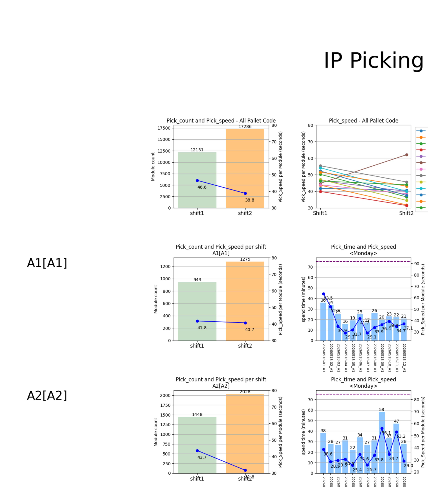

# IP Picking KPI



<sub>Weekly picking KPI by pallet code</sub>

> _Report preview. Operational volume metrics are shown as generated; the employer, customer/supplier names, order/part identifiers, and employee names have been redacted or replaced with placeholders for this public portfolio._


## Project Overview

Weekly warehouse picking KPI reporting system for Example Logistics (dock S3). Processes raw picking module data into dashboards consumed by Power BI and shared via SharePoint.

## Running the Report

```bash
python "IP Picking KPI v2.0.py"
```

The script is interactive — it prompts to confirm the Monday date, whether Saturday was worked, and reviews order groups before executing. Before running:
1. Replace `Data/Picking_MODULE.csv` with the latest week's export
2. Update `work9/IP_ShipRecord.xlsx` if needed

## Architecture

### Two-script design

**`IP Picking KPI v2.0.py`** (orchestrator, 296 lines) — user interaction, config generation, SharePoint sync, historical Excel update. Calls the engine via `subprocess` with a JSON config.

**`Work/IP_Picking_KPI_engine.py`** (engine, 1,014 lines) — all data transformation, aggregation, and chart generation. Takes the JSON config on stdin.

### Data flow

```
Data/Picking_MODULE.csv (152K rows)
  → engine: date/shift classification, order grouping, pallet code consolidation, speed calc
  → work9/  (15 CSVs + IP_Picking Group.xlsx)
  → Html/IP_Picking_KPI.html  (embedded base64 charts)
  → IP_Picking_total.xlsx  (historical append)
  → SharePoint: Shared BI/bi_reports/IP_Picking/BI Data/
  → Power BI: reads CSVs from work9/
```

### Key constants (engine)

| Constant | Value | Meaning |
|---|---|---|
| `BASE_TIME` | 75 sec | Baseline seconds/module shown on charts |
| `PICK_INTERVAL` | 20 min | Gap threshold for grouping picking sessions |
| Shift 1 | 06:00–16:30 | Morning shift |
| Shift 2 | 16:30–06:00 | Night shift (times 00:00–05:00 roll to previous day) |

### Order structure

Each date has 36 order IDs (`YYYYMMDD01`–`YYYYMMDD36`) grouped into **12 groups of 3** per day. Config generates these automatically from the Monday date.

### Pallet code categories

25+ raw codes are consolidated into 13 display categories:
`A1, A2, A3, B1, C, D1, D2, E1, E2, F, G, HJK (H/J/K combined), U`
Mapping lives in `set_pCode()` in the engine.

### Hardcoded paths

```python
BASE_DIR   = './IP Picking'
SHAREPOINT = './bi_data/IP_Picking/BI Data'
```

Both are machine-specific; update if moving to a different user profile.

## Output files

| File | Location | Purpose |
|---|---|---|
| `df_KPI*.csv`, `df_pcode*.csv`, `df_ope*.csv`, etc. | `work9/` | Power BI source data (15 files) |
| `IP_Picking Group.xlsx` | `work9/` | Order-to-group mapping for Power BI |
| `IP_Picking_total.xlsx` | `work9/` | Historical weekly speeds/counts (append-only) |
| `IP_Picking_KPI.html` | `Html/` | Self-contained HTML report with embedded charts |
| `IP KPI_Picking_week*.pbix` | root | Power BI report file |

## Input CSV columns

`PROCESS TIME` (YYYYMMDDHHmm), `OPCD`, `Op 1st/2nd Name`, `DOCK` (filtered to S3), `ORDER NO` (YYYYMMDDnn), `BACK ORDER` (* = supplement), `ROUTE`, `PALLET CODE`, `PRODUCT CODE`, `MODULE NO`, `PICK LOCATION`, `PICK ROUTE CODE`