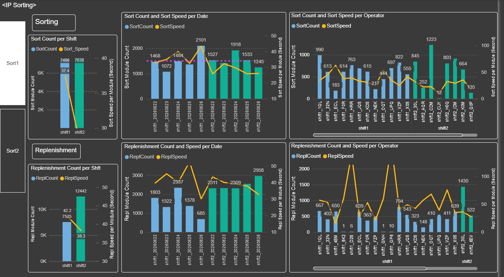

# IP Sorting KPI



<sub>Power BI dashboard — weekly IP sorting & replenishment KPI</sub>

> _Report preview. Operational volume metrics are shown as generated; the employer, customer/supplier names, order/part identifiers, and employee names have been redacted or replaced with placeholders for this public portfolio._


## How to Run

```bash
# Standard weekly run (auto-detects last Mon–Fri work week)
python "IP Sorting KPI v2.0.py"

# Include Saturday as a workday
python "IP Sorting KPI v2.0.py" --saturday

# Target a specific week (pass the Monday date)
python "IP Sorting KPI v2.0.py" --week-of 2026-04-20
```

The script is interactive — it will prompt for:
- Confirmation of the detected date range (`Proceed? [Y/n]`)
- Missing RTI/packing code mappings (if any are found during validation)

## Architecture

This is a **weekly KPI automation pipeline** for an IP Sorting warehouse operation. It is not a library; it is a single-use orchestration script run once per week by hand.

### Entry Point

`IP Sorting KPI v2.0.py` — the main orchestrator (~417 lines). It:
1. Resolves the target work week's dates
2. Runs a 502 combiner to build a module→RTI lookup
3. Executes the core KPI engine in a subprocess
4. Loops up to 5 times to resolve missing data interactively
5. Copies 13 output CSVs to the OneDrive-synced SharePoint folder

### Core KPI Engine

`Old/IP_Sorting_KPI_20260315ver8.py` — the calculation and charting engine (~850 lines). It is **not run directly**. The orchestrator dynamically patches six date variables into this file, then runs it as a subprocess. This isolation prevents state bleed between runs.

Key functions in the engine:
- `set_sum0()` — parse timestamps, assign shift (shift1: 06:00–16:29, shift2: 16:30–05:59)
- `set_sum1()` — group scans into sorting "runs" (gap > 20 min = new run)
- `set_sum2()` — compute speed metrics (seconds per box per run)
- `set_sum3()` — aggregate by operator and shift
- `set_progress1/2()` / `set_progress_list()` — compute order completion rates, pivot to route/date matrix

Output: a 15-subplot Matplotlib figure saved as base64 PNG embedded in `Html/IP_Sorting_KPI_<date>.html`, plus 13 intermediate CSVs in `Work3/`.

### Data Flow

```
Data/
  Replenishment_MIX-DELIVERY.csv   ─┐
  Replenishment_MIX-SORT.csv       ─┤─→ core KPI engine → Work3/*.csv + Html/*.html
  IP702.csv (location master)       ─┤
  RTI.xlsx (RTI/Dock/Code lookups)  ─┤
  502/
    502.csv (module-product master) ─┤
    MODULE_LOC_SITE2_CUST1_*.csv      ─┘ (daily snapshots, combined by 502 combiner)

Work3/*.csv  →  OneDrive sync  →  SharePoint/Teams  →  Power BI (.pbix)
```

### Key Hardcoded Values

| Constant | Value | Meaning |
|---|---|---|
| `SORT_INTERVAL` | 20 min | Gap threshold for new sorting run |
| `BASE_SORT_COUNT` | 1500 boxes | Baseline sort volume for shift1 |
| Shift1 | 06:00–16:29 | Day shift |
| Shift2 | 16:30–05:59 | Night shift |
| Speed target (sort) | 20–60 s/box | Shift1 acceptable range |
| Speed target (rep) | 35–70 s/box | Replenishment acceptable range |
| Valid dock codes | S3 (default), D0, C0, S0, S1 | Used when adding missing RTI entries |

### Validation Loop

After each KPI run the orchestrator checks two conditions:
1. **Missing modules** — products in Replenishment data that have no entry in `502.csv`. Auto-fixed by appending rows to `Data/502/502.csv` after prompting the user for the packing code.
2. **Blank RTI values** — products in 502 with no RTI mapping. Fixed by prompting the user for a packing code and dock, then writing a new row into `RTI.xlsx`.

Up to 5 iterations; if still unresolved after 5, the script aborts with a message to investigate manually.

### SharePoint / Power BI Integration

The SharePoint folder is OneDrive-synced locally at:
```
./bi_data/IP_Sorting/BI Data
```
The orchestrator copies the 13 output CSVs there; OneDrive handles the upload automatically. The Power BI file (`IP KPI_Sorting_week_*.pbix`) must be manually refreshed after the files are uploaded.

## Python Dependencies

Standard environment — no unusual packages:
- `pandas`, `numpy`, `matplotlib`, `openpyxl` (must be installed)
- `subprocess`, `datetime`, `pathlib`, `glob`, `base64`, `io` (stdlib)

## File Naming Conventions

- Input snapshots: `MODULE_LOC_SITE2_CUST1_<suffix>_<YYYYMMDD>_<seq>.csv`
- HTML output: `Html/IP_Sorting_KPI_<YYYYMMDD>.html`
- Work files: `Work3/df_<stage>.csv`
- Power BI: `IP KPI_Sorting_week_<YYYYMMDD>.pbix`