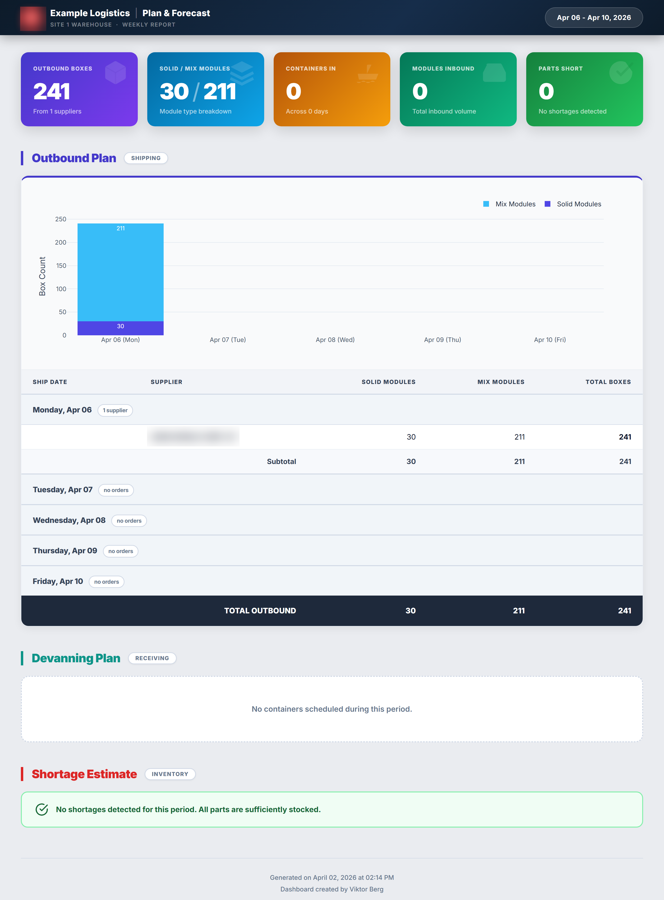

# IN Next-Week Plan & Forecast



<sub>Weekly plan & forecast dashboard</sub>

> _Report preview. Operational volume metrics are shown as generated; the employer, customer/supplier names, order/part identifiers, and employee names have been redacted or replaced with placeholders for this public portfolio._


## Project Overview

Generates the **Next Week Plan & Forecast** report for the Site 1 (SITE1) warehouse — a self-contained interactive HTML covering the next 5 business days (Mon–Fri). One Python script, one HTML output per run. Replaces the manual DS Weekly Order spreadsheet workflow.

The report combines three views in a single page:

1. **Outbound** — modules/units to be shipped per supplier per day
2. **Devanning** — inbound containers scheduled to arrive per day (from MPMT)
3. **Shortage** — parts where projected demand > (stock on hand + inbound this week)

## Running the script

```
python generate_report.py
```

No CLI flags. Defaults to the next Monday relative to today and the following 5 business days. Run from the project root so the relative `Data/` and `output/` paths resolve.

Dependencies: `pandas`, `numpy`, `plotly` (no `requirements.txt` checked in — install with `pip install pandas numpy plotly`).

## Folder structure

```
IN Next Week Plan and Forecast/
  generate_report.py
  Data/
    201-S.csv          # outbound orders
    502-N.csv          # current inventory
    701.CSV            # parts master (PCS/BOX, ITEM TYPE, MODEL/COLOR CODE)
    MPMT CHECK.xlsx    # devanning schedule (sheets: Schedule, data)
  output/
    Next Week Plan and Forecast (MM.DD.YYYY - MM.DD.YYYY).html
```

## Data sources (`Data/`)

| File | Provides | Key columns |
|---|---|---|
| `201-S.csv` | Outbound orders | `PRODUCT NO.`, `CUSTOMER ORDER NO.`, `QUANTITY`, `SHIP DATE`, `SUPPLIER CODE`, `SUPPLIER NAME` |
| `502-N.csv` | On-hand inventory snapshot | `COMM PRODUCT`, `QUANTITY` |
| `701.CSV` | Part master | `MODEL/COLOR CODE` (→ `MODEL`), `ITEM TYPE` (`SO`=Solid / `MX`=Mix), `PCS/BOX` |
| `MPMT CHECK.xlsx` | Container devanning schedule | Sheet `Schedule`: `DATE`, container col (header is variable: `CONTIANER`/`CONTAINER`/raw ID — always column index 1). Sheet `data`: `CONTAINER NUMBER`, `WAREHOUSE CLASS` (filtered to `SITE1`), `PART NUMBER IN ORDER OF MODEL`, `MODULE NUMBER`, `UNITLOAD CLASS` (`P`=Solid, `R`=Mix), `TRANSPORT MODE` (`S`/`A`/`O`), `QUANTITY` |

All inputs are operator-refreshed manually before each run.

## Pipeline

`generate_report.py` runs a single linear pipeline:

1. **`get_next_business_days`** — pick the next Monday and the 4 weekdays after it.
2. **`load_data`** — read the four input files. Strips spaces from product codes; normalises the variable container column on the MPMT `Schedule` sheet (always at index 1).
3. **`prepare_outbound`** — filter `201-S.csv` to the report week, dedupe identical rows, normalise product codes (drop dashes) to join against `701.CSV`, compute `BOXES = QUANTITY / PCS/BOX`, split into `MODULE_BOXES` (ITEM TYPE = `SO`) vs `UNIT_BOXES` (ITEM TYPE = `MX`), and pivot by supplier × ship date.
4. **`prepare_devanning`** — filter the MPMT `Schedule` sheet to the report week; on the `data` sheet keep only `WAREHOUSE CLASS == 'SITE1'`; classify each row as Solid (`UNITLOAD CLASS = P`) or Mix (`UNITLOAD CLASS = R`); count modules per container; map transport mode (`S→Sea`, `A→Air`, `O→Other`, default Sea).
5. **`calculate_shortages`** — sum demand from filtered orders, supply = stock (502) + inbound (MPMT containers in the week), `SHORTAGE = max(DEMAND - SUPPLY, 0)`. Convert pieces → modules using `701.PCS/BOX`.
6. **Chart generation** — Plotly stacked bar charts for outbound (Solid vs Mix per day) and devanning per day.
7. **HTML render** — single self-contained file written to `output/Next Week Plan and Forecast (MM.DD.YYYY - MM.DD.YYYY).html`.

## KPIs / business logic

- **Outbound boxes** per supplier per day, split Solid (Module) vs Mix (Unit) by `701.ITEM TYPE`.
- **Inbound containers / modules** per day, split Solid vs Mix by `UNITLOAD CLASS` (`P` vs `R`), tagged with transport mode.
- **Shortages** — `DEMAND - (STOCK + INBOUND)`, only positive values shown, sorted descending. Module count = `SHORTAGE / PCS/BOX`.

## Key conventions / gotchas

- **Product code matching** uses dash-stripped, whitespace-stripped strings on every join (`.str.replace('-', '')` + `.str.strip()`). Don't add joins that key on the raw `PRODUCT NO.`.
- **Planned ship date** in `parse_planned_date` is extracted from `CUSTOMER ORDER NO.` — pulls digits after the underscore (`DAOQ610_20260416`), or falls back to positions 8–16.
- **MPMT container column header is unstable** — it can be `CONTIANER`, `CONTAINER`, or a literal container ID. The script treats column index 1 as authoritative. Don't switch to header-based access.
- **Site 1 filter** — only rows with `WAREHOUSE CLASS == 'SITE1'` are kept from the MPMT `data` sheet. Other warehouses (SITE2, SITE3) are silently dropped.
- **Output filename uses dot-separated US dates** (`MM.DD.YYYY - MM.DD.YYYY`). Re-running for the same week overwrites.

## Output

| File | Purpose |
|---|---|
| `output/Next Week Plan and Forecast (MM.DD.YYYY - MM.DD.YYYY).html` | Self-contained interactive report — three sections (Outbound, Devanning, Shortage), with embedded Plotly charts. |

Each weekly run leaves a dated HTML in `output/`; older runs are kept for archival reference (no cleanup automation).

## Schedules / triggers

Manually run weekly by the operator. No Power Automate flow, no scheduled task.

## Configuration

No external config files. Tunables are at the top of `generate_report.py`:

```python
DATA_DIR = Path("Data")
OUTPUT_DIR = Path("output")
```

Country code map for supplier classes lives in `map_country_code` (JS, IS, Thai, MS, China).

## Dependencies

`pandas`, `numpy`, `plotly` — install with `pip install pandas numpy plotly`. Tested on Python 3.13.

## Known issues / gotchas

- `desktop.ini` is a Windows artifact — ignore.
- Hardcoded English month/day labels in chart axes (`%b %d (%a)`); the report is English-only.
- The MPMT container column header drift (see above) is a known fragility of the upstream Excel template — the script tolerates it via positional indexing.